# EncDotNet.S100

[](https://github.com/philliphoff/EncDotNet.S100/actions/workflows/ci.yml)
[](LICENSE)
[](https://github.com/philliphoff/EncDotNet.S100/releases)
[](https://dotnet.microsoft.com/)
[](https://dotnet.microsoft.com/)
[](https://www.nuget.org/packages?q=EncDotNet.S100)
[](https://philliphoff.github.io/EncDotNet.S100/)

## Overview

**EncDotNet.S100** is a managed, cross-platform implementation of the IHO
[S-100](https://iho.int/en/s-100-edition-5-2-0) Universal Hydrographic Data
Model for .NET. It provides:

- A set of **reusable libraries** for reading, portraying, and rendering
  S-100 product data — from ISO 8211 ENC cells to HDF5 coverage grids to
  GML feature collections — behind a common pipeline abstraction.
- A **cross-platform desktop viewer** (Avalonia + Mapsui) that loads any
  combination of supported products from an exchange set and renders
  them, time-aligned, on an interactive map.

The goal is to make S-100 data approachable for .NET developers and end
users without requiring native dependencies, commercial S-52 assets, or
platform-specific tooling. Everything runs on macOS, Windows, and Linux
out of the box.

## Supported standards

| Standard | Subject | Encoding | Portrayal |
|---|---|---|---|
| [**S-101**](https://iho.int/en/standards-in-development) | Electronic Navigational Charts | ISO 8211 | Lua (Part 9A) |
| [**S-102**](https://iho.int/uploads/user/pubs/standards/s-102/S-102_Edition_3.0.0_Final.pdf) | Bathymetric Surfaces | HDF5 | Coverage |
| [**S-104**](https://iho.int/uploads/user/pubs/Drafts/S-104_Edition_2.0.0_Final.pdf) | Water Level Information | HDF5 | Coverage |
| [**S-111**](https://iho.int/uploads/user/pubs/Drafts/S-111_Edition_2.0.0_Final-Clean.pdf) | Surface Currents | HDF5 | Coverage + arrows |
| **S-122** | Marine Protected Areas | GML | XSLT |
| **S-124** | Navigational Warnings | GML | XSLT |
| **S-125** | Marine Aids to Navigation | GML | XSLT |
| **S-127** | Marine Resources & Services | GML | XSLT |
| **S-128** | Catalogue of Nautical Products | GML | XSLT |
| **S-129** | Under Keel Clearance Management | GML | XSLT |
| **S-131** | Marine Harbour Infrastructure | GML | Lua (Part 9A) |
| **S-201** | Aids to Navigation Information (IALA) | GML | XSLT |
| **S-411** | Sea Ice Information | GML | XSLT |
| **S-421** | Route Plans | GML | XSLT |
| **S-57** *(legacy)* | Electronic Navigational Charts (Ed 3.1) | ISO 8211 | via S-101 pipeline |

S-57 cells are translated to the in-memory S-101 model so they render
through the S-101 portrayal pipeline. This is a best-effort path for
viewing legacy chart collections; it is **not** an S-52 implementation.

## The Viewer

`EncDotNet.S100.Viewer` is a cross-platform desktop nautical chart
viewer built on [Avalonia](https://avaloniaui.net/) and
[Mapsui](https://mapsui.com/). It loads any of the supported product
types — individually or together — and renders them on an interactive
map with a basemap underlay.

### Loading and managing datasets

Loaded datasets appear in the **Datasets** panel on the left. Each
entry has an inline visibility toggle and up / down buttons that
reorder the paint stack. Selecting an entry reveals a **Properties**
sub-panel with two tabs:

- **Dataset** — high-level information (product spec, current
  timestamp for time-varying datasets, loader status) and a
  whole-dataset opacity slider.
- **Layers** — per-sub-layer visibility and opacity for products that
  paint more than one layer (currently S-111, which has both a
  colour-band layer and an arrow layer).

A small toolbar above the list offers bulk **Show all**, **Hide all**,
**Isolate selected**, and **Reset opacity** actions.

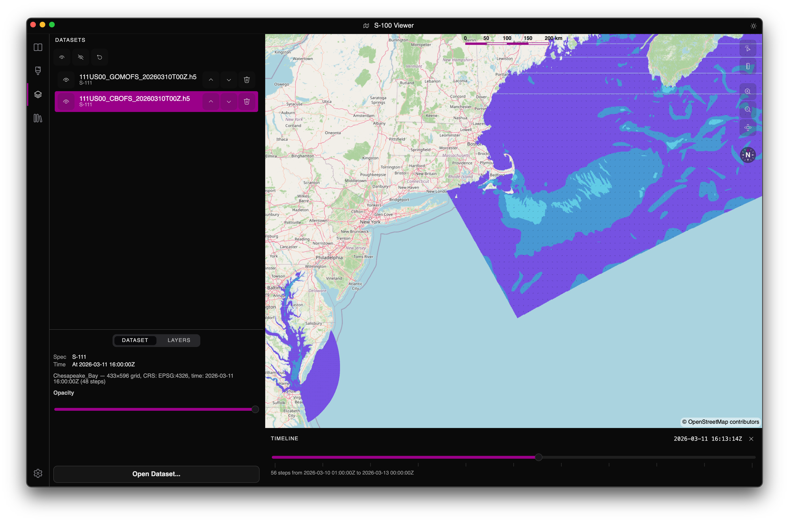

### ECDIS-style display filters

Standard ECDIS controls are available from the **View** menu:

- **Display category** (Base / Standard / Other) filtering for S-101.
- **Display plane** toggles to show or hide entire feature planes.
- **Text group** toggles for quickly suppressing or revealing labels.
- **Per-spec viewing group** overrides for fine-grained control.

### Pick / Object Information

Picking is performed in an ECDIS-style **Pick Mode**: toggle the
cross-hair button on the map toolbar (or **View → Appearance → Pick
Mode**, or press **`I`**) and then click any feature to open the
**Object Information** panel on the right — a "pick report" showing
the feature's class, identifier, source dataset, and full attribute
list. Press **`Esc`** to leave Pick Mode.

On macOS, **Cmd-click** (and **Ctrl-click** on Windows / Linux) acts
as a one-shot pick regardless of mode. A **press-and-hold** of about
half a second on any map location is also treated as a one-shot pick.

Attribute names and enumerated values are **decoded against the
product's feature catalogue** — codes like `CATPLE` are shown as
"Category of pile", and enum integers are shown with their
human-readable labels. **`xlink:href` references** to other features
(heavily used by S-125 AtoN status bindings and S-421 route
topology) appear under a **References** section; clicking a row
jumps the pick report to the referenced object.

Pick reports work for both vector products and coverage products —
clicking a coverage chart samples the underlying grid at the click
location and reports the per-cell value (depth + uncertainty for
S-102, water level + trend for S-104, current speed + direction for
S-111).

### Feature search

A **Search** field above the Datasets panel finds any feature across
every loaded dataset in a single keystroke. Type a feature class, a
human-readable name, or an identifier and pick a result to jump
straight to it in the Object Information panel. Equally happy with a
curated single-cell load or a folder full of overlapping exchange
sets.

### Global timeline for time-varying datasets

S-104 water levels, S-111 surface currents, and S-411 sea-ice
information all carry timestamps. When one or more of these is
loaded, a **global timeline** appears at the bottom of the map and
aggregates every time sample across the loaded datasets into a single
slider.

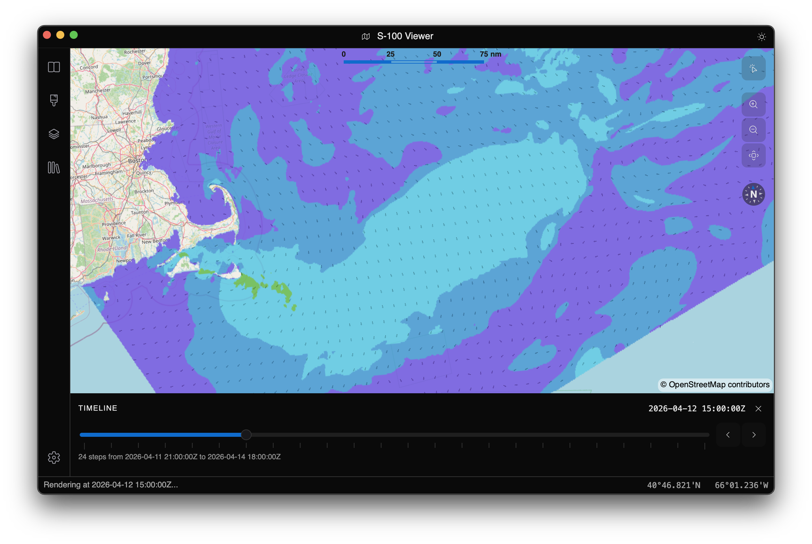

Drag the thumb to scrub time; every participating dataset is
re-rendered at the snapped sample. When all loaded datasets share
the same set of timestamps the slider shows discrete stops at each
one, plus previous / next buttons for single-step navigation;
otherwise it falls back to evenly-spaced guide ticks across the
aggregate range. The panel can be hidden from **View → Appearance →
Timeline**.

### Gallery

The viewer rendering each supported product:

#### S-101 — Electronic Navigational Charts

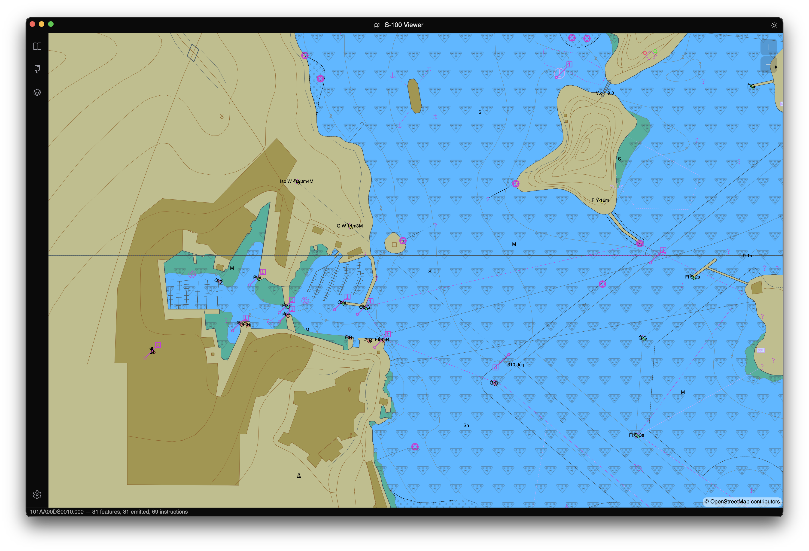

Vector chart data with IHO symbology including depth contours,
navigation aids, land areas, and other chart features.

#### S-102 — Bathymetric Surfaces


Colour-shaded bathymetric depth grids providing high-resolution
seafloor elevation data.

#### S-104 — Water Level Information


Gridded water level data for surface navigation, showing tidal and
non-tidal water level variations.

#### S-111 — Surface Currents


Gridded surface current data with both a colour-band layer and a
directional-arrow overlay.

#### S-122 — Marine Protected Areas

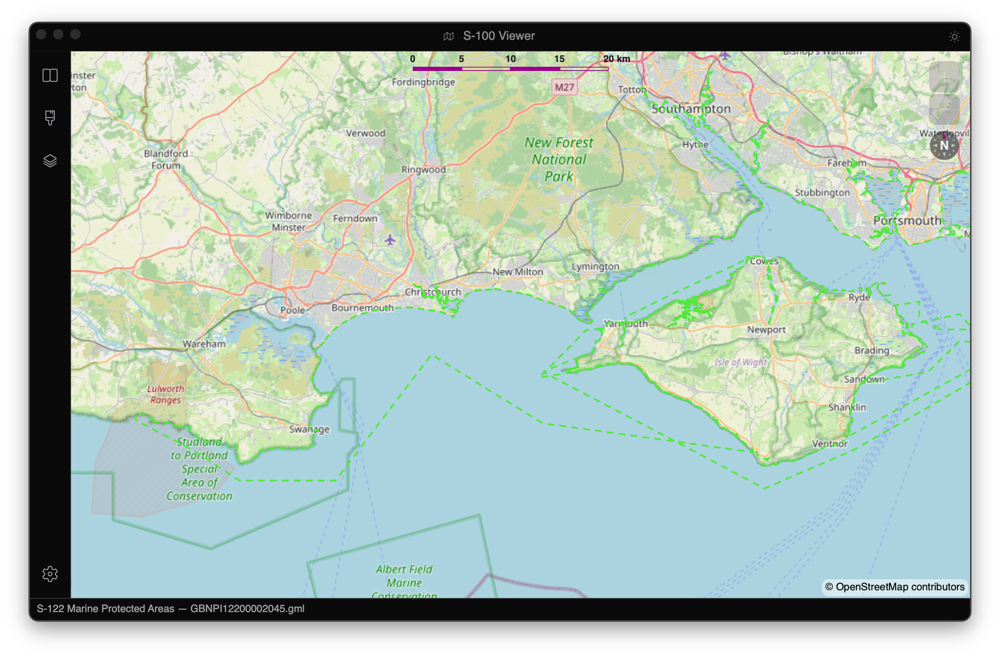

UK MPAs around the Solent and Isle of Wight from the UKHO trial
dataset.

#### S-124 — Navigational Warnings

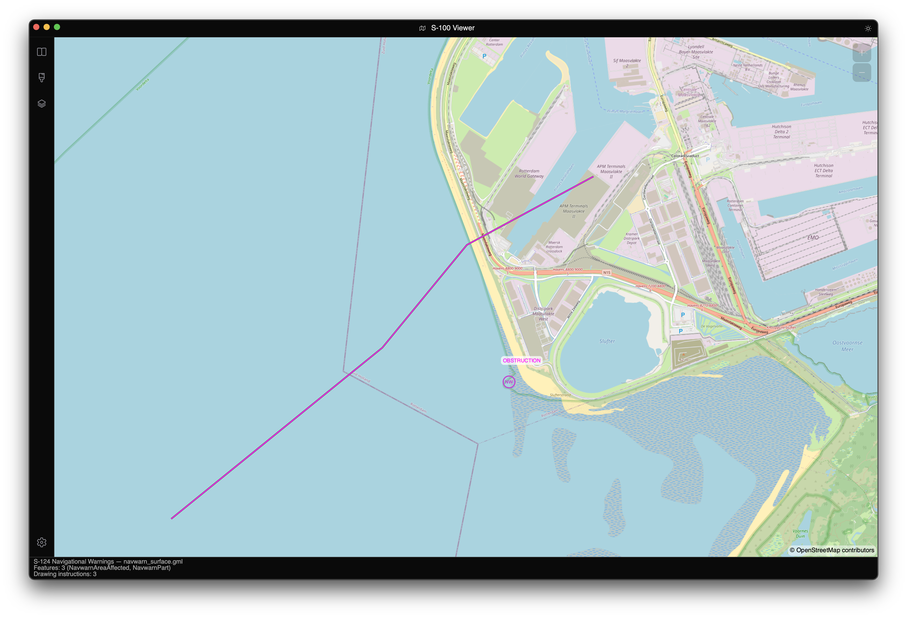

Navigational warnings highlighting hazards and notices to mariners.

#### S-125 — Marine Aids to Navigation

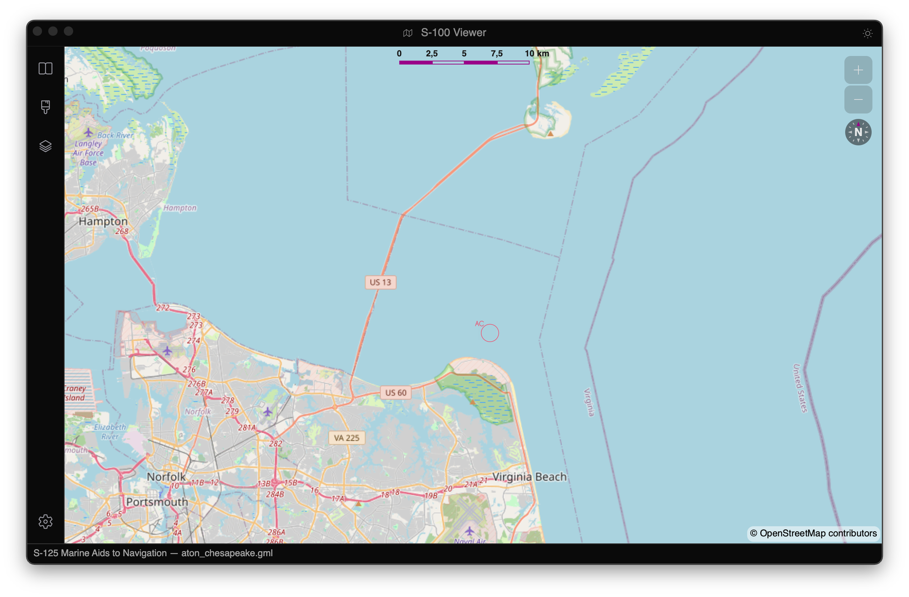

Lights, buoys, beacons, daymarks, and AIS aids, including AtoN
status indication symbology.

#### S-127 — Marine Resources & Services

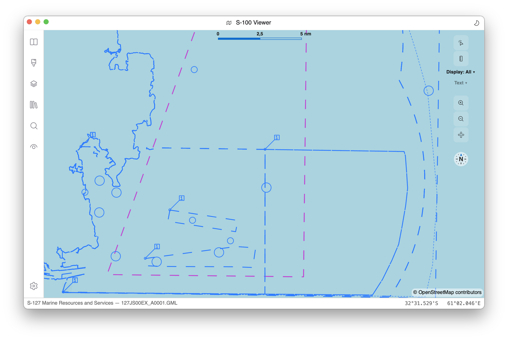

Pilot boarding places, routeing measures, restricted areas, vessel
traffic services, and signal stations rendered via XSLT portrayal.
Shown above: the official IHO sample `127JS00EX_A0001.GML`.

#### S-128 — Catalogue of Nautical Products

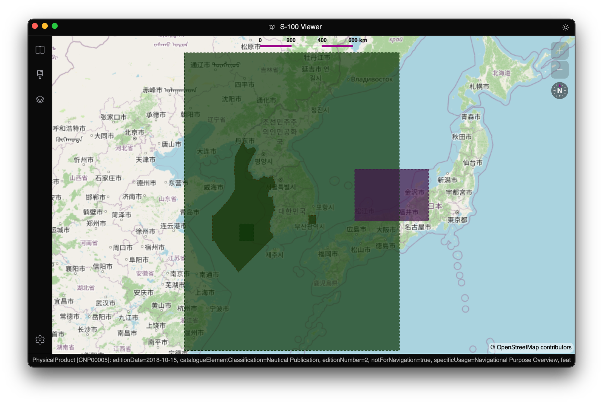

The official IHO 2.0.0 sample dataset covering East Asia: electronic
products (yellow), physical products (green), and S-100 services
(magenta) as semi-transparent coverage areas.

#### S-129 — Under Keel Clearance Management

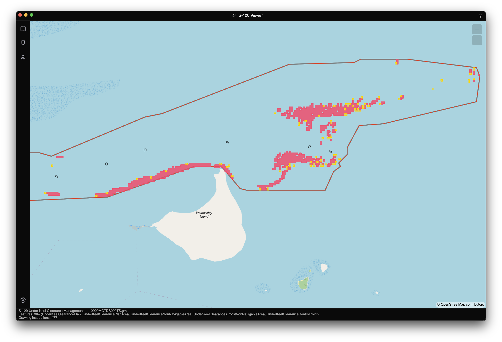

Under keel clearance data for safe navigation in shallow or
restricted waterways.

#### S-131 — Marine Harbour Infrastructure

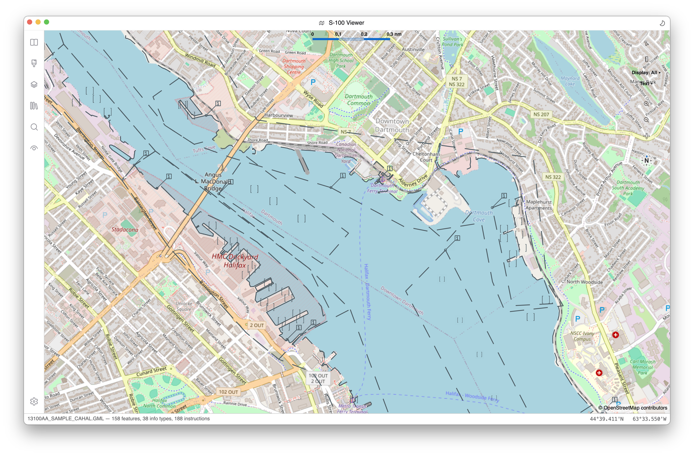

Berths, bollards, mooring buoys, anchorage areas, and terminals —
the first GML+Lua hybrid in this codebase.

#### S-411 — Sea Ice

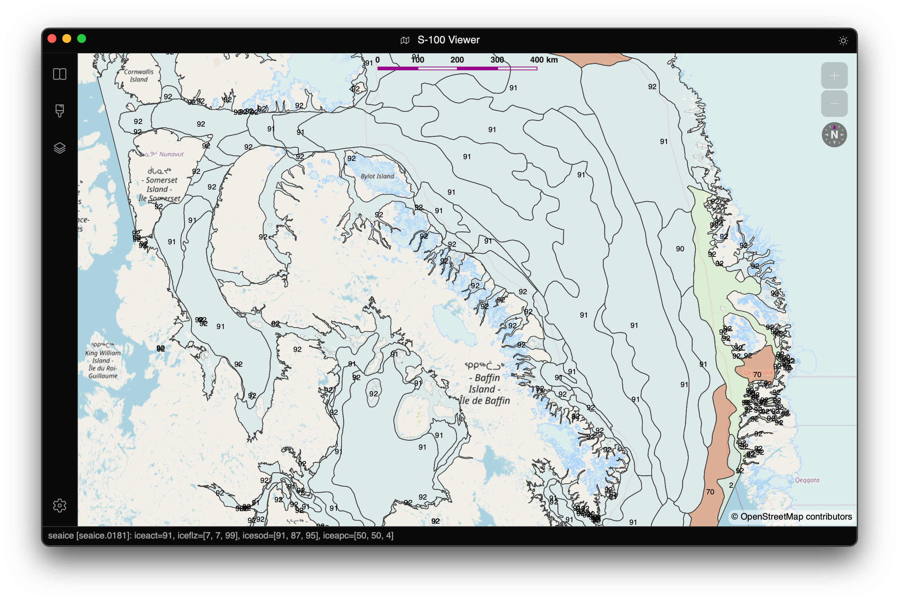

Sea-ice and lake-ice information: concentration, stage of
development, ice edges, and icebergs.

#### S-421 — Route Plans


Waypoints, route legs, and action points along a planned voyage.

#### S-57 — Legacy ENCs via the S-101 pipeline

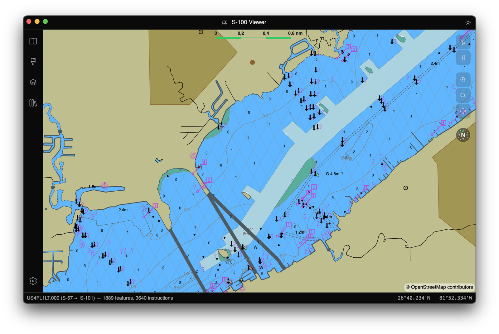

NOAA chart `US4FL1LT.000` (Caloosahatchee River, FL) — 1,889
features translated to S-101 producing 3,640 portrayal drawing
instructions. Per-feature mappings follow the IHO *S-57 to S-101
Conversion Guidance* document. **Not** an S-52 implementation.

## Libraries

For developers consuming EncDotNet.S100 directly, the solution is split
into focused packages:

### Core framework

| Package | Description |
|---|---|
| **EncDotNet.S100.Core** | Core abstractions and pipeline framework (asset sources, HDF5, Lua scripting, coverage and vector pipelines). |
| **EncDotNet.S100.Features** | Parser for S-100 Feature Catalogue XML files (ISO 19110 / S-100 Part 5). |
| **EncDotNet.S100.ExchangeSets** | Reader for S-100 Exchange Set catalogues and dataset/support file discovery. |
| **EncDotNet.S100.Portrayals** | Parser for S-100 Portrayal Catalogues (symbols, line styles, area fills, colour profiles, viewing groups). |
| **EncDotNet.S100.Specifications** | Bundles official feature and portrayal catalogues as embedded resources. |

### Encoding and scripting backends

| Package | Description |
|---|---|
| **EncDotNet.S100.Hdf5.PureHdf** | HDF5 reader implementation using [PureHDF](https://github.com/Apollo3zehn/PureHDF) (fully managed, no native dependencies). |
| **EncDotNet.S100.Scripting.MoonSharp** | Lua 5.2 scripting engine using [MoonSharp](https://github.com/moonsharp-devs/moonsharp). |

### Product datasets

| Package | Description |
|---|---|
| **EncDotNet.S100.Datasets.S101** | S-101 ENC reader and Lua portrayal pipeline. |
| **EncDotNet.S100.Datasets.S102** | S-102 bathymetric surface reader and coverage pipeline. |
| **EncDotNet.S100.Datasets.S104** | S-104 water level reader and coverage pipeline. |
| **EncDotNet.S100.Datasets.S111** | S-111 surface current reader and coverage pipeline. |
| **EncDotNet.S100.Datasets.S122** | S-122 marine protected areas reader and XSLT portrayal pipeline. |
| **EncDotNet.S100.Datasets.S124** | S-124 navigational warnings reader and XSLT portrayal pipeline. |
| **EncDotNet.S100.Datasets.S125** | S-125 marine aids to navigation reader, strongly-typed `DataModel` projection (with xlink-resolved AtoN status), and XSLT portrayal pipeline. |
| **EncDotNet.S100.Datasets.S127** | S-127 marine resources and services reader and XSLT portrayal pipeline. |
| **EncDotNet.S100.Datasets.S128** | S-128 catalogue of nautical products reader, XSLT portrayal pipeline, and typed `DataModel` projection with resolved supersedes navigation. |
| **EncDotNet.S100.Datasets.S129** | S-129 under keel clearance reader and XSLT portrayal pipeline. |
| **EncDotNet.S100.Datasets.S131** | S-131 marine harbour infrastructure reader and Lua portrayal pipeline (GML+Lua hybrid). |
| **EncDotNet.S100.Datasets.S201** | S-201 aids to navigation information (IALA, authority-to-authority exchange) reader, XSLT portrayal pipeline, and strongly-typed AtoN inventory data model. |
| **EncDotNet.S100.Datasets.S411** | S-411 sea ice reader and XSLT portrayal pipeline. |
| **EncDotNet.S100.Datasets.S421** | S-421 route plan reader and XSLT portrayal pipeline. |
| **EncDotNet.S100.Datasets.S57** | Legacy S-57 ENC reader that translates to the in-memory S-101 model. |

### Renderers

| Package | Description |
|---|---|
| **EncDotNet.S100.Renderers.Skia** | Coverage and vector rendering to [SkiaSharp](https://github.com/mono/SkiaSharp) bitmaps. |
| **EncDotNet.S100.Renderers.Mapsui** | Rendering of S-100 data into [Mapsui](https://mapsui.com/) map layers with CRS projection. |

### MCP server

| Package | Description |
|---|---|
| **EncDotNet.S100.Mcp.Tools** | Foundation for a Model Context Protocol server: `IDatasetCatalog` abstraction and the tool surface (`list_datasets`, `describe_feature`, `sample_coverage`). Transport-agnostic. See [its README](src/EncDotNet.S100.Mcp.Tools/README.md). |
| **EncDotNet.S100.Mcp** | Streamable HTTP MCP server that exposes the `Mcp.Tools` surface. UI-agnostic; bound to `127.0.0.1` by default, off by default, no authentication. The viewer hosts this opt-in; see [its README](src/EncDotNet.S100.Mcp/README.md) and the [agent walkthrough](docs/mcp-server.md). |

## Building

```sh
dotnet build
```

Running the viewer:

```sh
dotnet run --project src/EncDotNet.S100.Viewer
```

## Observability

The libraries are instrumented with `Microsoft.Extensions.Logging`,
`System.Diagnostics.ActivitySource`, and `System.Diagnostics.Metrics.Meter`,
and the viewer ships an OpenTelemetry OTLP exporter configured by the
standard `OTEL_*` environment variables. The fastest way to see logs,
traces, and metrics is the bundled .NET Aspire host:

```sh
dotnet run --project src/EncDotNet.S100.AppHost
```

This starts the Aspire dashboard and the viewer in one step — open the
printed `http://localhost:15069/login?t=…` URL to inspect them. See
[`docs/observability.md`](docs/observability.md) for the span tree,
metrics catalogue, and alternative recipes (standalone Aspire
dashboard, Jaeger).

## Performance

Scripted performance scenarios for profiling pipeline, portrayal, and
rendering costs:

```sh
# Run a scenario
dotnet run --project tools/EncDotNet.S100.PerfRunner -- s124-vector

# Summarise a run
dotnet run --project tools/EncDotNet.S100.PerfReport -- summarise perf-runs/<file>.jsonl

# Diff two runs
dotnet run --project tools/EncDotNet.S100.PerfReport -- diff baseline.jsonl candidate.jsonl
```

See [PerfRunner README](tools/EncDotNet.S100.PerfRunner/README.md) and
[PerfReport README](tools/EncDotNet.S100.PerfReport/README.md) for
details.

## License

This project is licensed under the [MIT License](LICENSE).
