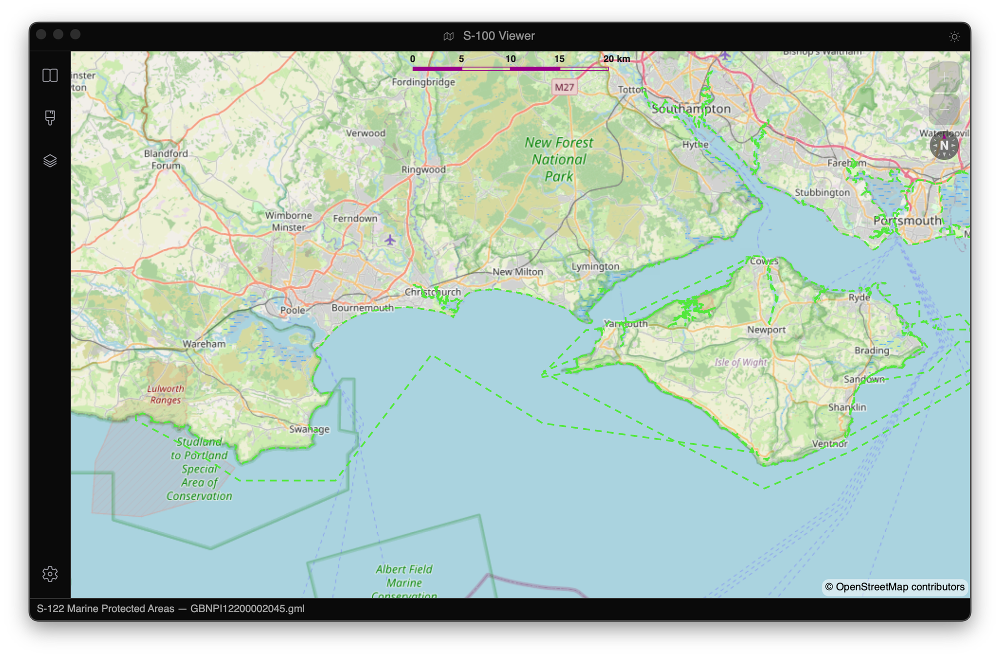
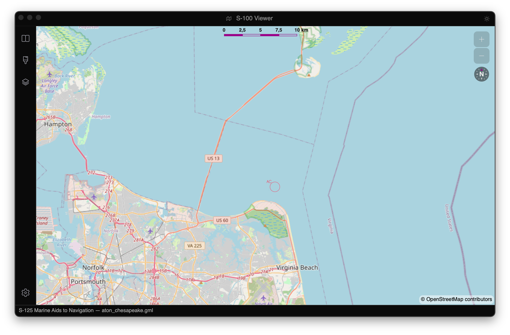
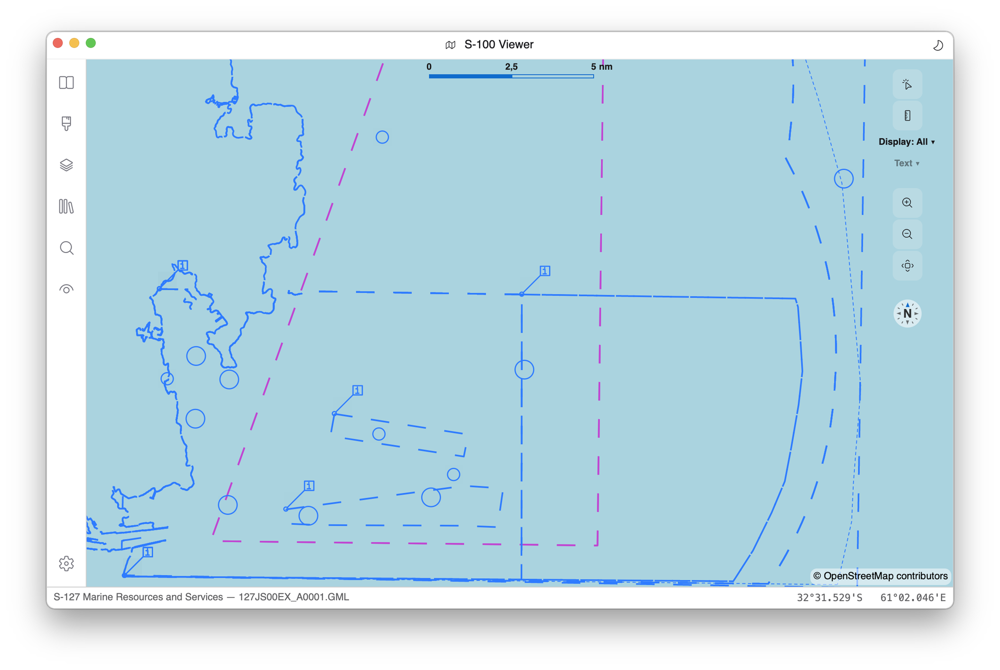
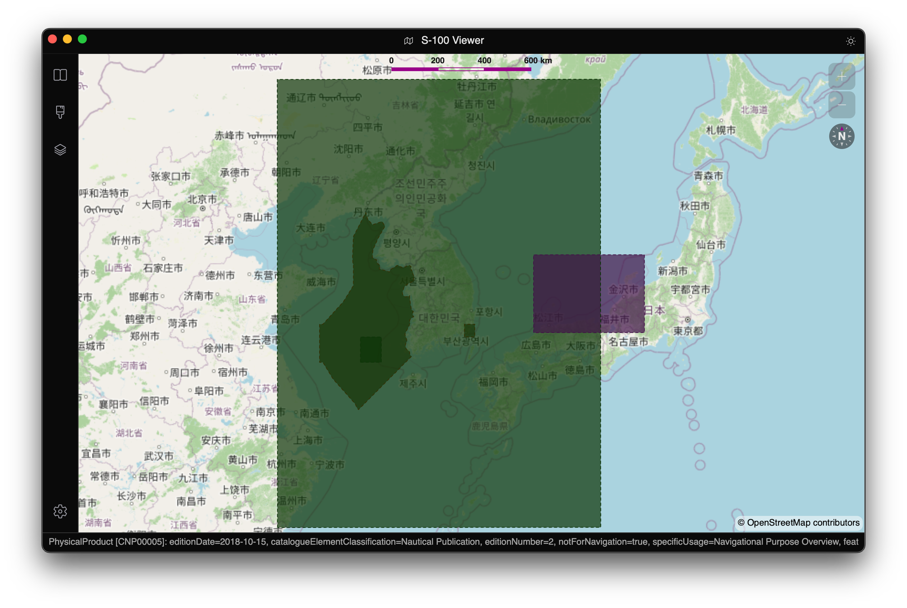
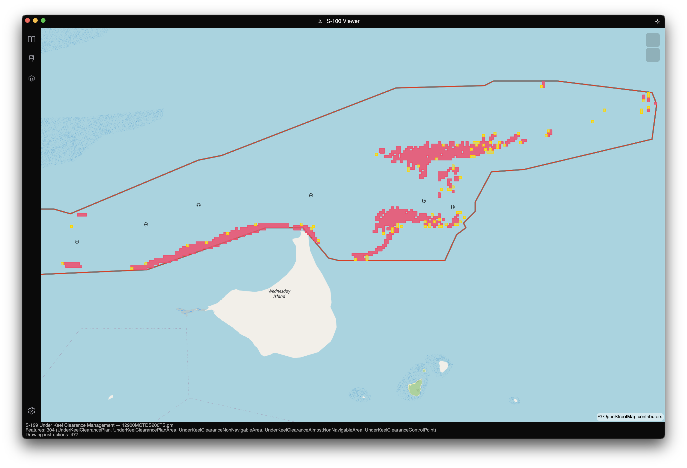
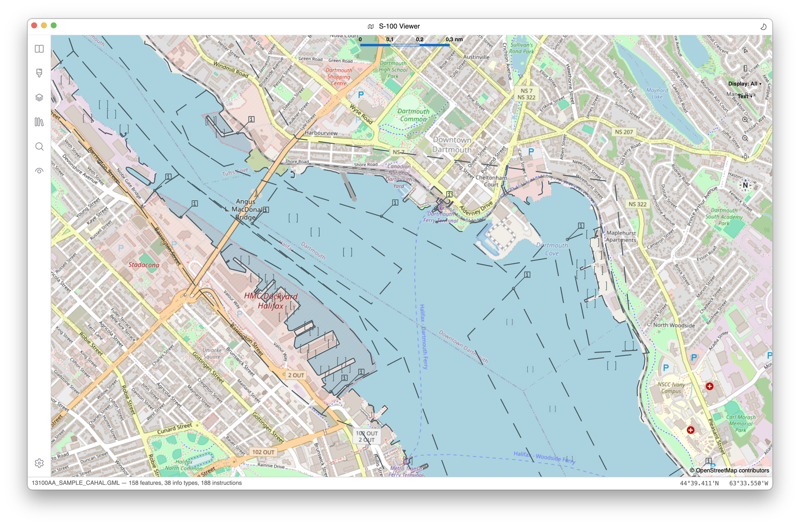
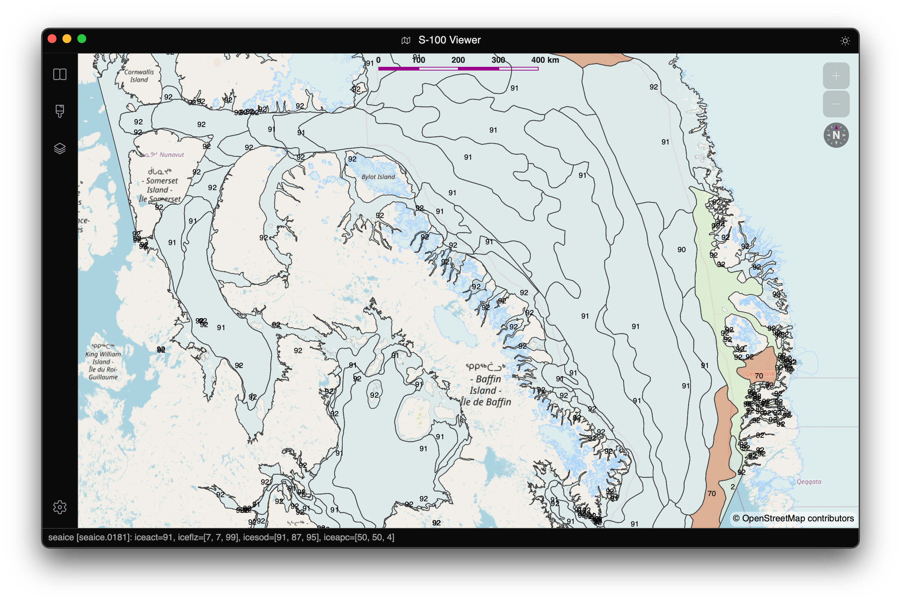
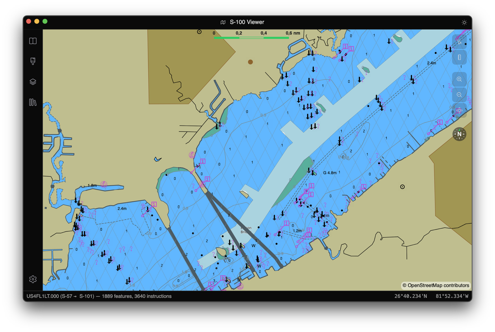

# EncDotNet.S100

[](https://github.com/philliphoff/EncDotNet.S100/actions/workflows/ci.yml)
[](LICENSE)
[](https://github.com/philliphoff/EncDotNet.S100/releases)
[](https://dotnet.microsoft.com/)
[](https://www.nuget.org/packages?q=EncDotNet.S100)
[](https://philliphoff.github.io/EncDotNet.S100/)
[](https://discord.gg/kf6B9EZqqB)

## Overview

**EncDotNet.S100** is a managed, cross-platform implementation of the
IHO [S-100](https://iho.int/en/s-100-edition-5-2-0) Universal
Hydrographic Data Model for .NET. In plain terms, it reads and draws
**electronic nautical charts and related marine data layers** —
depths, currents, water levels, navigational warnings, aids to
navigation, and more — and it runs on macOS, Windows, and Linux. It
provides:

- A set of **reusable libraries** for reading, portraying, rendering,
  and **validating** S-100 product data — from ISO 8211 ENC cells to
  HDF5 coverage grids to GML feature collections — behind a common
  pipeline abstraction.
- A **cross-platform desktop viewer** (Avalonia + Mapsui) that loads
  any combination of supported products from an exchange set or as
  loose files and renders them, time-aligned, on an interactive map.
- A **standalone command-line tool** (`s100`) that renders any
  supported dataset to a PNG from the shell — self-contained, with no
  .NET install required — for batch and headless scripting.
- An **optional MCP server** that exposes loaded datasets to AI
  agents — feature discovery and query (`identify_features`,
  `nearest_features`, `count_features`, `describe_feature`), coverage
  sampling, interactive route planning, and live viewer control
  (drive the viewport, capture the view, steer the own-ship).

The goal is to make S-100 data approachable for .NET developers and
end users without requiring native dependencies, commercial S-52
assets, or platform-specific tooling. Everything runs on macOS,
Windows, and Linux out of the box.

## Getting started

**Just want to look at charts?** Download the desktop viewer from the
[latest release](https://github.com/philliphoff/EncDotNet.S100/releases)
— a pre-built, self-contained app for macOS, Windows, and Linux (no
.NET install required) — and open a file or exchange set. The
[getting-started guide](docs/getting-started.md#desktop-app) walks
through it, and the [viewer section](#the-viewer) below tours the
features.

**Building on top of the data?** **[docs/getting-started.md](docs/getting-started.md)**
also walks you from zero to a rendered PNG in a few minutes — via either the
batteries-included `EncDotNet.S100` library facade or the standalone `s100`
command-line tool.

```csharp
using EncDotNet.S100;

using var dataset = S100Dataset.Open("chart.000");   // detects the spec
using var renderer = new PngS100DatasetRenderer();
byte[] png = await renderer.RenderAsync(dataset);     // bundled FC + PC
File.WriteAllBytes("out.png", png);
```

The runnable
[`samples/EncDotNet.S100.Samples.Quickstart`](samples/EncDotNet.S100.Samples.Quickstart)
console project demonstrates this end-to-end against a bundled synthetic
fixture — `dotnet run` it with no setup.

## Supported standards

Every supported product ships a reader, a portrayal pipeline, and a
normative validation rule pack.

| Standard | Subject | Encoding | Portrayal | Validation pack |
|---|---|---|---|---|
| **S-101** | Electronic Navigational Charts | ISO 8211 | Lua (Part 9A) | ✅ |
| **S-102** | Bathymetric Surfaces | HDF5 | Coverage (Lua) | ✅ |
| **S-104** | Water Level Information | HDF5 | Coverage | ✅ |
| **S-111** | Surface Currents | HDF5 | Arrow symbology | ✅ |
| **S-122** | Marine Protected Areas | GML | XSLT | ✅ |
| **S-124** | Navigational Warnings | GML | XSLT | ✅ |
| **S-125** | Marine Aids to Navigation | GML | XSLT | ✅ |
| **S-127** | Marine Resources & Services | GML | XSLT | ✅ |
| **S-128** | Catalogue of Nautical Products | GML | XSLT | ✅ |
| **S-129** | Under Keel Clearance Management | GML | XSLT | ✅ |
| **S-131** | Marine Harbour Infrastructure | GML | Lua (Part 9A) | ✅ |
| **S-201** | Aids to Navigation Information (IALA) | GML | XSLT | ✅ |
| **S-411** | Sea Ice Information | GML | XSLT | ✅ |
| **S-421** | Route Plans | GML | XSLT | ✅ |
| **S-57** *(legacy)* | Electronic Navigational Charts (Ed 3.1) | ISO 8211 | via S-101 pipeline | ✅ (delegated) |

S-57 cells are translated to the in-memory S-101 model and rendered
through the S-101 portrayal pipeline; validation runs as two passes
with S-101 findings rebadged `S101-as-S57/*` so the user can tell
which layer of the pipeline a finding came from. This is a
best-effort path for viewing legacy chart collections; it is **not**
an S-52 implementation.

## The Viewer

`EncDotNet.S100.Viewer` is a cross-platform desktop nautical chart
viewer built on [Avalonia](https://avaloniaui.net/) and
[Mapsui](https://mapsui.com/). It loads any combination of the
supported products and renders them time-aligned over an
OpenStreetMap basemap. Headline features:

- **Multi-product paint stack** driven by the S-98 interoperability
  authority (display planes, within-plane priority, inter-product
  rules) rather than load order.
- **Activity-bar panels** for Datasets, Layer Stack, ECDIS Display
  Controls, Object Information (pick reports), Routes, Vessels (AIS
  targets + own-ship), Validation, and Settings — every panel can be
  docked, hidden, or rearranged, and the layout persists between
  sessions.
- **Interactive route planning** — build editable, persistent routes
  aligned to the in-repo S-421 route model: a numbered waypoint / leg
  timeline with per-leg great-circle or rhumb-line geometry and live
  distance and bearing, drawn and edited directly on the map (and
  drivable by an AI agent through the MCP route tools).
- **Pick / Object Information** for both vector and coverage
  products, with FC-decoded attribute names, follow-the-`xlink`
  reference navigation, and an embedded time-series chart for
  fixed-station S-104 / S-111 observations.
- **ECDIS-style controls** — display category, display planes, text
  groups, per-spec viewing groups, Day / Dusk / Night palettes, and
  mariner settings (safety contour, depth contours, four shades,
  simplified symbols, radar overlay).
- **Global timeline** for time-varying datasets (S-104, S-111,
  S-411).
- **Validation panel** with click-to-zoom, severity colouring, and
  an overlay marker layer.
- **In-app feedback and crash recovery** — a Report Feedback flow
  that bundles diagnostics into a pre-filled GitHub issue, plus
  next-startup detection and reporting of unclean shutdowns.
- **Live overlays** through the dynamic-feature-source abstraction —
  an own-ship glyph with true-scale hull + arrowhead + CCRP cross at
  zoom, plus an **AIS-target overlay** backed by the
  [aisstream.io](https://aisstream.io) WebSocket service and rendered
  with a per-class palette using the same hull/arrowhead vocabulary.
- **Optional MCP server** (off by default) exposing the loaded
  datasets to AI agents.

See [the viewer README](src/EncDotNet.S100.Viewer/README.md) for the
full feature guide, and the per-product gallery below for what each
product looks like in the viewer.

### Gallery

| Product | Screenshot |
|---|---|
| S-101 ENC |  |
| S-102 Bathymetry |  |
| S-104 Water Level |  |
| S-111 Surface Currents |  |
| S-122 Marine Protected Areas |  |
| S-124 Navigational Warnings |  |
| S-125 Marine AtoN |  |
| S-127 Marine Services |  |
| S-128 Catalogue |  |
| S-129 UKC |  |
| S-131 Marine Harbour |  |
| S-411 Sea Ice |  |
| S-421 Route Plan |  |
| S-57 (via S-101) |  |

## Command-line tool

`s100` is a cross-platform console tool that renders any supported
product to a PNG, JPEG, or WebP from the shell — and **validates**
datasets and exchange sets against the normative rule packs — driving
the same portrayal and validation pipelines as the viewer through a
headless Skia renderer, no UI required. It is suited to batch and
scripted previews (sea-ice, surface-current, and chart thumbnails)
and to CI conformance checks.

```sh
s100 render dataset.h5 out.png --palette night -w 2048 -h 1536
s100 validate exchange-set/    # normative rules + exchange-set integrity
s100 info dataset.h5           # detected spec, edition, and time steps
s100 list-specs                # supported products
```

Each [release](https://github.com/philliphoff/EncDotNet.S100/releases)
attaches a self-contained, per-platform archive that bundles the .NET
runtime and native libraries, so **no .NET installation is required** —
download, extract, and run. The same executable also ships inside the
viewer application bundle. See [docs/cli.md](docs/cli.md) for the full
command and option reference.

## Libraries

For developers consuming EncDotNet.S100 directly, the solution is
split into focused packages.

### Convenience facade

| Package | Description |
|---|---|
| **EncDotNet.S100** | Batteries-included on-ramp: open a dataset, read its features, and render it to an image using the bundled feature and portrayal catalogues — no hand-wiring of catalogues or pipelines. Start here; drop down to the focused packages below only when you need finer control. |

### Core framework

| Package | Description |
|---|---|
| **EncDotNet.S100.Core** | Pipeline abstractions (asset sources, HDF5, Lua, coverage + vector pipelines), the validation framework, and the dynamic-feature-source abstraction. |
| **EncDotNet.S100.Features** | Parser for S-100 Feature Catalogue XML files (ISO 19110 / S-100 Part 5). |
| **EncDotNet.S100.ExchangeSets** | Reader for S-100 Exchange Set catalogues and dataset/support file discovery, with signature/checksum **integrity verification** and S-100 Part 15 data-protection (decryption) support. |
| **EncDotNet.S100.Portrayals** | Parser for S-100 Portrayal Catalogues (symbols, line styles, area fills, colour profiles, viewing groups). |
| **EncDotNet.S100.Specifications** | Bundles official feature and portrayal catalogues as embedded resources. |

### Encoding and scripting backends

| Package | Description |
|---|---|
| **EncDotNet.S100.Hdf5.PureHdf** | HDF5 reader implementation using [PureHDF](https://github.com/Apollo3zehn/PureHDF) (fully managed, no native dependencies). |
| **EncDotNet.S100.Scripting.MoonSharp** | Lua 5.2 scripting engine using [MoonSharp](https://github.com/moonsharp-devs/moonsharp). |
| **EncDotNet.S100.Crs.ProjNet** | CRS transform backend (`ICrsTransformFactory`) using [ProjNet](https://github.com/NetTopologySuite/ProjNet4GeoAPI) — WGS84 UTM zones and EPSG:4326 ↔ EPSG:3857. Mapsui-free, so headless consumers (the facade and the `s100` CLI) can reproject coverage products without linking a map renderer. |

### Product datasets

| Package | Description |
|---|---|
| **EncDotNet.S100.Datasets.S101** | S-101 ENC reader (incl. sequential updates), Lua portrayal pipeline, validation pack (`S101DatasetView` façade + 10 rules). |
| **EncDotNet.S100.Datasets.S102** | S-102 bathymetry reader, coverage pipeline, validation pack. |
| **EncDotNet.S100.Datasets.S104** | S-104 water level reader, coverage pipeline, validation pack. |
| **EncDotNet.S100.Datasets.S111** | S-111 surface currents reader, coverage pipeline (per-feature arrow symbology), validation pack. |
| **EncDotNet.S100.Datasets.S122** | S-122 marine protected areas reader, XSLT portrayal pipeline, validation pack. |
| **EncDotNet.S100.Datasets.S124** | S-124 navigational warnings reader, XSLT portrayal pipeline, validation pack. |
| **EncDotNet.S100.Datasets.S125** | S-125 marine aids to navigation reader (with typed AtoN projection and xlink-resolved status), XSLT portrayal, validation pack. |
| **EncDotNet.S100.Datasets.S127** | S-127 marine resources and services reader, XSLT portrayal pipeline, validation pack. |
| **EncDotNet.S100.Datasets.S128** | S-128 catalogue of nautical products reader (with typed `DataModel` projection), XSLT portrayal, validation pack. |
| **EncDotNet.S100.Datasets.S129** | S-129 under keel clearance reader, XSLT portrayal pipeline, validation pack. |
| **EncDotNet.S100.Datasets.S131** | S-131 marine harbour infrastructure reader, Lua portrayal pipeline (GML+Lua hybrid), validation pack. |
| **EncDotNet.S100.Datasets.S201** | S-201 aids to navigation information (IALA) reader, XSLT portrayal pipeline, typed AtoN inventory data model, validation pack. |
| **EncDotNet.S100.Datasets.S411** | S-411 sea ice reader, XSLT portrayal pipeline, validation pack. |
| **EncDotNet.S100.Datasets.S421** | S-421 route plan reader, XSLT portrayal pipeline, validation pack. |
| **EncDotNet.S100.Datasets.S57** | Legacy S-57 ENC reader that translates to the in-memory S-101 model; pre-translation rules + delegation to the S-101 validation pack. |
| **EncDotNet.S100.Datasets.Pipelines** | Per-spec `IDatasetProcessor` implementations, the S-98 interoperability authority, the validation runner, and the `ConcatReports` rebadge helper used by S-57. |

The **EncDotNet.S100.Datasets.S129.Fusion** library (project reference,
not published to NuGet) is a purely additive cross-product helper that
fuses an S-129 under-keel-clearance plan with the typed S-102, S-104,
and S-421 datasets it references and exposes a time-indexed view over
the plan.

### Renderers

| Package | Description |
|---|---|
| **EncDotNet.S100.Renderers.Skia** | Coverage and vector rendering to [SkiaSharp](https://github.com/mono/SkiaSharp) bitmaps. |
| **EncDotNet.S100.Renderers.Mapsui** | Rendering of S-100 data into [Mapsui](https://mapsui.com/) map layers with CRS projection, plus dynamic-feature-source renderers (own-ship hull + arrowhead, AIS-target hull + per-class palette, default disc/line/polygon fallback). |

### Dynamic feature sources

These ship in the repository but are **not currently published to
NuGet** — consume them via project reference (or through the viewer).

| Project | Description |
|---|---|
| **EncDotNet.S100.DynamicSources.Ais** | Decoder-agnostic AIS dynamic feature source: per-MMSI cache, ITU-R M.1371-aligned aging, projection to `DynamicFeature` with sentinel-collapsed motion. See [its README](src/EncDotNet.S100.DynamicSources.Ais/README.md). |
| **EncDotNet.S100.DynamicSources.Ais.Drivers.AisStreamIo** | Production driver implementing `IAisMessageSource` over [aisstream.io](https://aisstream.io)'s WebSocket service. BCL-only (no third-party AIS or WebSocket deps). See [its README](src/EncDotNet.S100.DynamicSources.Ais.Drivers.AisStreamIo/README.md). |

### MCP server

These ship in the repository but are **not currently published to
NuGet** — consume them via project reference (or through the viewer).

| Project | Description |
|---|---|
| **EncDotNet.S100.Mcp.Tools** | Transport-agnostic Model Context Protocol tool surface (`list_datasets`, `describe_feature`, `sample_coverage`). See [its README](src/EncDotNet.S100.Mcp.Tools/README.md). |
| **EncDotNet.S100.Mcp** | Streamable HTTP host that exposes the `Mcp.Tools` surface plus the viewer-injected `render_to_image` tool; bound to `127.0.0.1` by default, off by default, no authentication. See [its README](src/EncDotNet.S100.Mcp/README.md) and the [agent walkthrough](docs/mcp-server.md). |

## Building

```sh
dotnet build
```

Running the viewer:

```sh
dotnet run --project src/EncDotNet.S100.Viewer
```

Pre-built per-platform binaries are attached to every
[release](https://github.com/philliphoff/EncDotNet.S100/releases).
The macOS DMG is Developer-ID signed and Apple-notarized; the Windows
`.exe` is Authenticode-signed via Azure Trusted Signing. Windows
ships as architecture-tagged `zip` archives and Linux as
architecture-tagged `tar.gz` archives. The standalone `s100`
command-line tool is also attached per platform as
`s100-<version>-<rid>` (`.zip` on Windows, `.tar.gz` on macOS/Linux);
see [docs/cli.md](docs/cli.md) for install instructions.

## Observability

The libraries are instrumented with `Microsoft.Extensions.Logging`,
`System.Diagnostics.ActivitySource`, and
`System.Diagnostics.Metrics.Meter`, and the viewer ships an
OpenTelemetry OTLP exporter configured by the standard `OTEL_*`
environment variables. The fastest way to see logs, traces, and
metrics is the bundled .NET Aspire host:

```sh
dotnet run --project src/EncDotNet.S100.AppHost
```

See [`docs/observability.md`](docs/observability.md) for the span
tree, metrics catalogue, and alternative recipes (standalone Aspire
dashboard, Jaeger).

## License

This project is licensed under the [MIT License](LICENSE).
