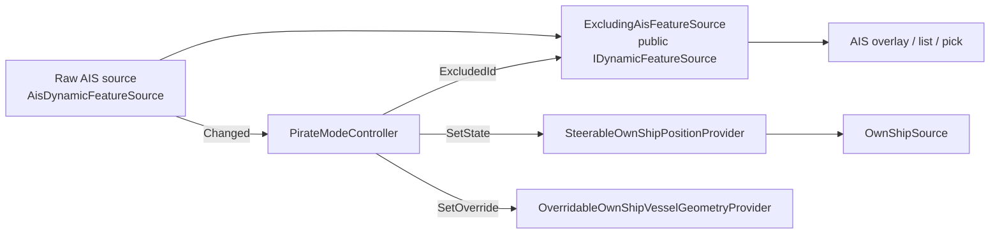

# Steerable own-ship and "pirate mode"

## Motivation

The own-ship overlay was originally driven by a fixed dead-reckoning
provider (Solent start, course 090° T, 5 m/s) with **no way to influence
it**. That is poor for demos and unusable for testing the safety features
on the roadmap (CPA/TCPA, anti-grounding guardian, route monitoring), all
of which need own-ship to be *somewhere specific on purpose*.

Two complementary controls close the gap:

- **Steerable mock ("helm mode")** — keep dead-reckoning, but expose
  position / course / speed / heading / turn-rate as mutable state driven
  by a helm panel, the `set_own_ship` MCP tool, and CLI flags.
- **"Pirate mode"** — own-ship adopts a live AIS target's position, COG,
  SOG, heading, and dimensions, updating as that target reports. It is
  realised *as* helm mode: an external feed (the AIS source) periodically
  pushes corrections into the same dead-reckoning integrator, so motion
  stays smooth between sparse reports.

## The seam

Everything hangs off three internal interfaces in
`Services/DynamicSources/OwnShip/`:

| Interface | Role |
|---|---|
| `IOwnShipPositionProvider` | Read side: `Current` fix + `Updated` event. `OwnShipSource` (an `IDynamicFeatureSource`) subscribes and republishes. |
| `IOwnShipHelm` | Write side: `SetState`, `SetCourse`/`NudgeCourse`, `SetSpeed`/`NudgeSpeed`, `SetTurnRate`, `SteerToward`, `Hold`/`Resume`. |
| `IOwnShipHelmState` | Read-side control state for the helm panel. |

A single `SteerableOwnShipPositionProvider` singleton implements all
three. Every helm mutation publishes a fresh fix via `Updated`.
`SetState(lat, lon, cog?, sog?, heading?)` replaces only the non-null
components (null = "keep current"). **No renderer, overlay-host, or
layer-stack change is needed** — every piece is a new implementation
behind the seam plus new control surfaces.

Heading is first-class: `OwnShipPosition` carries a nullable
`HeadingDeg`, and `OwnShipSource` publishes it separately rather than
always mirroring COG → heading (the mirror remains the fallback when
heading is null). Without this, pirate-mode hull orientation is wrong for
targets whose heading differs from their course made good.

## Control surfaces

- **Helm panel** (`HelmView` / `HelmViewModel`) — an activity-bar panel,
  visible only while the own-ship overlay is enabled
  (`OwnShipTrackingVisibilitySource` bridges the settings flag to tab
  visibility). Binds to `IOwnShipHelm` / `IOwnShipHelmState`.
- **MCP** — the `set_own_ship` tool (`{ lat?, lon?, cog?, sog?, heading?,
  hold? }`) drives the helm independently of overlay visibility, so an
  agent can pre-position own-ship before enabling the overlay or taking a
  screenshot.
- **CLI** — `--own-ship-pos`, `--own-ship-cog`, `--own-ship-sog` flags.

## Pirate mode

### Two AIS surfaces

The controller must see the very target it is following, so it subscribes
to the **raw, undecorated** AIS source. Everything user-facing (overlay,
vessel list, pick) reads the **`ExcludingAisFeatureSource`** decorator,
which hides the followed target so it is not drawn twice. To guarantee a
matched pair, only the decorator is registered as `IDynamicFeatureSource`;
the controller takes the decorator and derives its raw partner from
`ExcludingAisFeatureSource.Inner`. The decorator raises `Reset`/`Changed`
whenever `ExcludedId` changes so the overlay re-reads immediately rather
than lagging to the next AIS event.

### Geometry override

`OverridableOwnShipVesselGeometryProvider` wraps the settings-backed
provider. While pirate mode is active it serves the target's
`DynamicVesselGeometry`; a separate `_hasOverride` flag distinguishes
"no override → user's configured size" from "override active but the
target reported no dimensions → pictogram fallback", so impersonating an
unknown-size target does **not** fall back to the user's own dimensions.
Adopted dimensions are never written into `ViewerSettings`.

### Controller correctness

All of `Follow`, `Stop`, and each fix application run under a single lock
**including** their side effects (`helm.SetState`, `exclusion.ExcludedId`,
geometry override). This closes the re-target / stop races where a stale
fix or a stuck geometry override could land after the user moved on.
Geometry is set *before* the helm fix. The helm and geometry services
never call back into the controller, so holding the lock across them
cannot deadlock.

- `Follow` returns `AppliedFix` when the target is already present, or
  `ArmedWaiting` when the AIS source has not yet reported it (e.g. a
  zoom-gated `DeferredAisFeatureSource` that has not activated).
- `Stop` leaves the helm at the last adopted fix — the steerable provider
  keeps dead-reckoning from there (no teleport back to the Solent seed).
- Target loss (AIS sweep / `TargetLost`) keeps dead-reckoning rather than
  freezing or jumping.

### Application glue

`PirateModeCoordinator` holds the app-level side effects that don't belong
in the controller:

- **Engage(mmsi)** — persist `OwnShipPositionSource = FollowAisTarget` +
  `OwnShipFollowMmsi`; open both visibility gates (the overlay-enable flag
  *and* the dynamic-source registry visibility for `"ownship"`, also
  persisted into `DynamicSourceVisibility` so a startup restore survives
  the window where the registry has not yet attached); then
  `controller.Follow`.
- **Disengage()** — `controller.Stop()` and revert the source to
  `Simulated`. Wired to fire automatically when the user turns the
  own-ship overlay off, so the followed (hidden) AIS target can never be
  left invisible with no own-ship drawn in its place.
- **RestoreFromSettings()** — re-arm at launch when the saved source is
  `FollowAisTarget`.

### Entry point

`PickReportViewModel` exposes a `TakeHelmCommand` gated to AIS hits (the
`"ais:{mmsi}"` feature-id convention from
`AisDynamicFeatureSource.FeatureIdForMmsi`). It raises
`TakeHelmRequested(mmsi)`, which the app routes to
`PirateModeCoordinator.Engage`. The **Take the helm** button appears only
on AIS rows in the Pick Report.

## Known limitations / follow-ups

- **Waiting / error state.** When the AIS source is disabled or not yet
  active, `Follow` returns `ArmedWaiting` and own-ship shows the simulated
  seed until the first fix arrives. There is no explicit "waiting for
  target" indicator yet; a helm-panel status line is a natural follow-up.
- **Map gestures.** "Steer here" / "place own-ship here" right-click
  gestures and a draggable heading vector are deferred (Phase 3b).
- **CLI `--own-ship-follow MMSI`.** Pirate mode from the command line
  needs a first-fix wait/timeout policy so a screenshot run does not
  capture the seed before the AIS fix lands; deferred.
