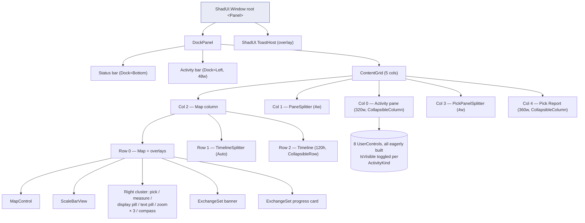

# Viewer panel design inventory

> **Status:** read-only audit, May 2026. Intended as input to a future
> refactor brief. Captures *what is*, not *what should be*. Cites file
> paths + line numbers throughout so reviewers can jump in fast.

## 1. Overview

The viewer's chrome is a single Avalonia `ShadUI.Window`
(`MainWindow.axaml`, 1018 lines) that hosts ~15 distinct visual
surfaces — VS Code-style activity bar with a swappable side panel, a
right-hand Pick Report column, a bottom Timeline row, a cluster of map
overlay controls, two floating exchange-set overlays, a status bar,
and a toast host. All panel content is bound to a single
`MainViewModel` graph that aggregates twelve child view-models
(`MainViewModel.cs:21-32`, constructor args at `MainViewModel.cs:519-538`)
plus an `ActivityKind?` enum (`ViewModels/ActivityKind.cs`) that drives
which activity-bar tab is selected.

The activity-bar pattern is uniform: 8 `ToggleButton.ActivityIcon`
entries each bound to one `IsXxxSelected` flag and a `SelectXxxCommand`
on `MainViewModel`. The activity pane itself is a single
`<Panel>` containing all eight UserControl children with `IsVisible`
toggled per-tab (`MainWindow.axaml:364-381`) — i.e. all panel views are
**eagerly constructed** when the window opens and toggled, not built
on-demand. Everything else (Pick Report, Timeline, banner, progress
card, map overlays) is inline in `MainWindow.axaml` rather than living
in its own `UserControl`, with one exception each (TimelineView and
ScaleBarView).

The audit found 7 distinct hosting patterns, with the Pick Report and
DatasetsView being the largest sources of divergence. Visibility flags
are persisted but sizes (panel widths, timeline height, splitter
positions) are not, which is the most consistently asymmetric
cross-cutting issue.

## 2. Shell layout

`MainWindow.axaml` root is a `<Panel>` (line 136) so that the
`shadui:ToastHost` (line 1013) can overlay everything else. Inside that
Panel sits a single `<DockPanel>` whose docked children are the status
bar (bottom, line 139), the activity bar (left, line 181), and the
fill-child `ContentGrid` (line 332).

```
┌─────────────────────────────────────────────────────────────────┐
│ ShadUI.Window (chrome + title bar, "Map" logo)                  │
│ ┌───┬───────────────────────────────────────────────────────┐   │
│ │ A │ ContentGrid (5 columns)                               │   │
│ │ c │ ┌──────┬─┬────────────────────────────────────┬─┬───┐ │   │
│ │ t │ │ Col0 │S│ Col2 = map column (3 rows)         │S│ C │ │   │
│ │ i │ │ Act- │p│ ┌────────────────────────────────┐ │p│ o │ │   │
│ │ v │ │ ivity│l│ │ Row0 = MapControl + overlays   │ │l│ l │ │   │
│ │ B │ │ Pane │i│ │       (ScaleBar top, ZoomBtns  │ │i│ 4 │ │   │
│ │ a │ │ 320w │t│ │        right cluster, Compass, │ │t│   │ │   │
│ │ r │ │      │t│ │        ExchangeSet banner &    │ │t│ P │ │   │
│ │   │ │      │e│ │        progress card)          │ │e│ i │ │   │
│ │ 48│ │      │r│ ├────────────────────────────────┤ │r│ c │ │   │
│ │ w │ │      │ │ │ Row1 = TimelineSplitter (Auto) │ │ │ k │ │   │
│ │ i │ │      │ │ ├────────────────────────────────┤ │ │   │ │   │
│ │ d │ │      │ │ │ Row2 = TimelineView (120h)     │ │ │360│ │   │
│ │ e │ │      │ │ └────────────────────────────────┘ │ │ w │ │   │
│ └───┴────────────────────────────────────────────────────┘   │
│ Status bar (DockPanel.Dock=Bottom, 26h)                         │
└─────────────────────────────────────────────────────────────────┘
ToastHost (BottomRight, overlaid via outer <Panel>)
```



## 3. Panel inventory

Columns: **Loc** (file), **Host** (where it lives), **Layout**,
**Vis** (visibility/collapse), **DI** (construction),
**Data** (key services / events), **Size** (width / height
conventions + persistence), **Compliance** (loc / tooltip / splitter
rules per `.github/instructions/viewer.instructions.md`).

### 3.1 Activity bar (the strip itself)

| Axis | Value |
|---|---|
| **Loc** | `MainWindow.axaml:181-329` (inline `Border` with `DockPanel`) |
| **Host** | `DockPanel.Dock="Left"` child of root DockPanel |
| **Layout** | Outer `DockPanel`; bottom `StackPanel` for Settings, top `StackPanel` for 7 main activities, each entry a `Grid` with a 3-px accent rail `Border` overlaid by a `ToggleButton.ActivityIcon` (48×48) |
| **Vis** | Always visible. Width fixed at 48px (line 185). |
| **DI** | XAML-only. Commands resolved off `MainViewModel.Select*Command`. |
| **Data** | Each toggle: `IsChecked="{Binding IsXxxSelected, Mode=OneWay}"` + `Command="{Binding SelectXxxCommand}"`. The `OneWay+Command` idiom (`MainWindow.axaml:215-216`) avoids feedback loops that a `TwoWay` IsChecked would create — `SelectedActivity` setter (`MainViewModel.cs:35-62`) toggles to `null` if you click the same activity again. |
| **Size** | Fixed 48w; per-row 48h. No persistence. |
| **Compliance** | All `ToolTip.Tip` sourced from `Strings.Tooltip_*`. ✅ |

### 3.2 Activity pane (host of swappable side views)

| Axis | Value |
|---|---|
| **Loc** | `MainWindow.axaml:332-383` |
| **Host** | `ContentGrid` column 0 |
| **Layout** | `Border` → `DockPanel` (`PaneTitle` header band on top, content `<Panel>` fill) |
| **Vis** | `IsVisible="{Binding IsPaneVisible}"` (`MainViewModel.cs:64`, derived from `SelectedActivity.HasValue`). 8 child views all live in the same `<Panel>`, each `IsVisible` bound to its own `IsXxxSelected` flag (lines 365-380). |
| **DI** | All 8 child VMs registered as singletons in `App.axaml.cs:241-255`; views consume them via XAML `DataContext="{Binding Xxx}"`. |
| **Data** | `PaneTitle` derived from a `switch` on `_selectedActivity` (`MainViewModel.cs:66-77`) — adding a new tab requires editing 4 places in `MainViewModel` (enum, switch, flag property, command). |
| **Size** | Star-sized 320w, MinWidth=200, MaxWidth=600 (line 334-338) with `bh:CollapsibleColumn` behavior. Width NOT persisted; resets to 320 every session. |
| **Compliance** | Splitter on column 1 uses `Classes="PaneSplitter"` + `bh:HoverDelay.DelayMilliseconds="500"`. ✅ |

#### 3.2.x Eight activity-pane views

| Tab | View | Layout & notable internal structure |
|---|---|---|
| Feature Catalogues | `Views/FeatureCataloguesView.axaml` (59 lines) | `DockPanel`, Add button bottom, `ScrollViewer` + `ItemsControl` body. Built-in vs custom rows. |
| Portrayal Catalogues | `Views/PortrayalCataloguesView.axaml` (59 lines) | Byte-identical structurally to Feature Catalogues — two near-duplicate views. |
| Datasets | `Views/DatasetsView.axaml` (667 lines) | Most complex tab. Top: exchange-set header rows + 3-button bulk toolbar. Body: master/detail Grid with own internal `GridSplitter.PaneSplitter` (line 437-444) + **duplicate `PaneSplitter` style block** (lines 18-34) + duplicate `TabControl.CenteredTabs` template override (lines 51-78) for an internal `TabControl` with **Dataset / Layers / Validation (badge-decorated)** tabs (lines 462-578+). The Validation tab has its own severity-keyed badge styles (lines 102-139) and clickable `Button.FindingRow` row template. |
| Catalog | `Views/CatalogPanelView.axaml` (296 lines) | Empty-state `Border` and a populated `Grid` (master list / splitter / details). Has its own internal `GridSplitter` and `PaneSplitter` style block (lines 16-26). Details pane is sticky-header + ScrollViewer with a "Not for navigation" warning banner and a property grid. |
| Layer Stack | `Views/LayerStackView.axaml` (134 lines) | Header (ShowEmptyPlanes checkbox) + tree of `Expander`-per-DisplayPlane → checkbox + opacity per entry. |
| Search | `Views/FeatureSearchView.axaml` (120 lines) | Top query box, footer result-count, `ListBox` body with its own selection-style block. |
| Settings | `Views/SettingsView.axaml` (287 lines) | Single `ScrollViewer` with a long `StackPanel` of sections: accent color picker, color profile, symbol scale, depth/distance/time unit, MCP, mariner depths. No header band of its own — relies on outer pane header. |
| ECDIS Display | `Views/EcdisDisplayPanelView.axaml` (120 lines) | Empty-state TextBlock + ScrollViewer body: display-category RadioButtons, display-plane CheckBoxes, "Reset all overrides" Button, then a repeated per-spec section (`ItemsControl` of `EcdisSpecViewModel`) with viewing-group checkboxes. |

### 3.3 Pick Report (right column)

| Axis | Value |
|---|---|
| **Loc** | `MainWindow.axaml:704-1010` — **inline, not a UserControl**, ~306 lines of XAML embedded in MainWindow |
| **Host** | `ContentGrid` column 4 |
| **Layout** | `Border` → `DockPanel`: header band (title + close button), sticky `StackPanel` (hit list / identity / references), then a `ScrollViewer` whose body is a `ContentControl` with two `DataTemplate`s (`S104StationTimeSeriesViewModel`, `S111StationTimeSeriesViewModel`) plus an attribute `TreeView` that swaps between inline and `Expander` form depending on `HasStationSeries` |
| **Vis** | `IsVisible="{Binding IsPickPanelVisible}"`. Critically, `IsPickPanelVisible = _isPickPanelEnabled && PickReport.HasPick` (`MainViewModel.cs:185`) — *both* an activity-style user toggle *and* a content-presence gate. There is no activity-bar entry for it; toggling the user flag goes through `TogglePickPanelCommand` (`MainViewModel.cs:187`), which is reachable only via the menu. |
| **DI** | `PickReportViewModel` singleton (`App.axaml.cs:250`); the actual view is XAML inline (no `UserControl`). |
| **Data** | `PickReport.PropertyChanged` observed by MainViewModel (`MainViewModel.cs:596-600`) to re-raise `IsPickPanelVisible` whenever `HasPick` flips. `PickReportViewModel` carries `Hits`, `SelectedHit`, `Attributes` (`PickAttribute` tree), `References` (`FeatureReference[]`), `SelectedStationSeries` (S-104 or S-111 view model). |
| **Size** | 360w, MinWidth=240, MaxWidth=600, `CollapsibleColumn`. Width NOT persisted. |
| **Compliance** | `PickPanelSplitter` uses `Classes="PaneSplitter"` + 500ms hover delay. ✅ All visible strings localised via `Strings.Pick_*` and `Strings.Tooltip_*`. ✅ |

### 3.4 Timeline (bottom row)

| Axis | Value |
|---|---|
| **Loc** | View: `Views/TimelineView.axaml` (130 lines); host: `MainWindow.axaml:689-694` |
| **Host** | Inner Grid row 2 inside `ContentGrid` column 2 (the map column) |
| **Layout** | `Border` → `DockPanel`: title row (with `CurrentTimeLabel` + close button) + body `<Panel>` with an active state (Slider + step buttons + range label) and an empty state |
| **Vis** | `IsVisible="{Binding IsTimelineVisible}"` (user toggle) + `IsActive` (derived from `GlobalTimeService.IsActive`) gates the slider vs empty-state. `Timeline.CloseRequested` event raised by the close button is observed in `MainViewModel.cs:595` and flips `IsTimelineVisible=false`. |
| **DI** | `TimelineViewModel` singleton (`App.axaml.cs:251`); owns a `GlobalTimeService` reference. |
| **Data** | `GlobalTimeService` ⇒ `Slider`-bound properties (`SliderMinimum`, `SliderMaximum`, `SliderValue`, `Ticks`, `TickFrequency`, `IsSnapToTickEnabled`); per-step prev/next buttons. |
| **Size** | Row height fixed at 120, MinHeight=100, with `bh:CollapsibleRow` behavior (lines 400-403). **Height NOT persisted.** |
| **Compliance** | `TimelineSplitter` is `Classes="PaneSplitter"` + 500ms hover delay. ✅ |

### 3.5 Map overlay cluster (top-right of map row)

| Axis | Value |
|---|---|
| **Loc** | `MainWindow.axaml:411-603` — single right-aligned, top-anchored `StackPanel` |
| **Host** | Inline in inner-Grid row 0 of map column |
| **Children** | (a) `PickModeButton` toggled via `Classes.pickActive` (`MainWindow.axaml:416-469`), with a ~50-line embedded style block to fight ShadUI's `Border#HoverBackground` template layer; (b) `MeasureModeButton` same idiom with `Classes.measureActive` (lines 476-501); (c) **Display category pill** — a `Button` with a `Flyout` containing 4 `RadioButton`s, each with its own `<RadioButton.Command>` block (lines 506-547); (d) **Text group pill** — same pattern with 3 `CheckBox`es and `<CheckBox Command>` bindings (lines 552-575); (e) inner `StackPanel` with margin 16,16 containing ZoomIn/ZoomOut/ZoomToExtent buttons (lines 582-598); (f) `CompassRoseView` (custom code-based control). The whole cluster is non-modal. |
| **Vis** | All controls always visible. Toggle visual state via class swaps; flyouts open on user click. |
| **DI** | Buttons wired by code-behind in `MainWindow.axaml.cs` for zoom (named elements `ZoomInButton` etc., outside surveyed range but referenced); pick/measure go through `Tools` controller on the VM; pills bind to `DisplayToolbar` and `TextToolbar` child VMs. |
| **Data** | Tools controller (`MapToolController.ActiveToolChanged`) flips the `Classes.*Active` state through `MainViewModel.Tools.ActiveToolChanged` handler (`MainViewModel.cs:667-678`). |
| **Size** | All map-overlay buttons share `Classes="MapOverlay"` for legible foreground (style at `MainWindow.axaml:105-110`). |
| **Compliance** | Every button has `ToolTip.Tip` from `Strings.Tooltip_*`. ✅ |

### 3.6 ScaleBarView

| Axis | Value |
|---|---|
| **Loc** | View: `Views/ScaleBarView.axaml` (14 lines), code-behind builds Canvas children dynamically; Host: `MainWindow.axaml:407-410` |
| **Host** | Top-center anchor on map row 0 (positioned via HorizontalAlignment="Center"/VerticalAlignment="Top") |
| **Layout** | Two stacked `Canvas`es: 14h labels + 5h bar |
| **Vis** | Always visible. `IsHitTestVisible="False"` so it never absorbs map gestures. |
| **DI** | Pure XAML + code-behind. No VM. |
| **Data** | Code-behind subscribes to map navigation; not a VM-bound surface. |

### 3.7 ExchangeSet partial-failure banner

| Axis | Value |
|---|---|
| **Loc** | `MainWindow.axaml:609-632` — inline `Border` |
| **Host** | Map row 0 (overlay), anchored Top-Stretch with `Margin="48,4,180,0"` so it clears the scale bar |
| **Vis** | `IsVisible="{Binding IsExchangeSetBannerVisible}"` — manually dismissable via `DismissExchangeSetBannerCommand`. |
| **Layout** | `DockPanel`: dismiss `Button` right, message `TextBlock` fill. |
| **Compliance** | `Strings.Banner_Dismiss` + `Strings.Tooltip_*`. ✅ |

### 3.8 ExchangeSet progress card

| Axis | Value |
|---|---|
| **Loc** | `MainWindow.axaml:638-676` — inline `Border` with `DropShadowEffect` |
| **Host** | Map row 0 (overlay), Center-Center, MinWidth=320, MaxWidth=480 |
| **Vis** | `IsVisible="{Binding IsExchangeSetLoading}"` — soft-modal (map still pannable underneath but no second exchange-set load can start). |
| **Layout** | `StackPanel`: title, source label, `ProgressBar` (4h), counter+dataset row, Cancel button. |
| **Data** | `IExchangeSetService` orchestrates; MainViewModel surfaces `ExchangeSetSourceLabel`, `ExchangeSetProgressFraction`, `ExchangeSetCounter`, `ExchangeSetCurrentDataset`, `CancelExchangeSetCommand`. |

### 3.9 Status bar

| Axis | Value |
|---|---|
| **Loc** | `MainWindow.axaml:139-178` |
| **Host** | `DockPanel.Dock="Bottom"`, fixed 26h |
| **Vis** | `IsVisible="{Binding IsStatusBarVisible}"` — persisted (`ViewerSettings.IsStatusBarVisible`, default true). Toggled via `ToggleStatusBarCommand` (menu only). |
| **Layout** | Right-docked widgets in order: `McpStatusText` (visible when running), `MouseLatLonText`, `MeasureSummary` (visible while measuring); fill = `StatusText`. |
| **Data** | `StatusText` is fronted by `IStatusPresenter` (`MainViewModel.cs:99-109`) so commands can update status from any layer; other widgets are direct properties. |

### 3.10 ToastHost

| Axis | Value |
|---|---|
| **Loc** | `MainWindow.axaml:1013-1016` |
| **Host** | Sibling of `DockPanel` inside root `<Panel>` so it overlays everything; positioned `BottomRight` with bottom margin 30. |
| **DI** | `ShadUI.ToastManager` singleton in `App.axaml.cs:221`; `IToastService` adapter (line 222) injected into VMs. |
| **Data** | Toasts raised from many places (port conflicts, recent-file errors, validation, etc.). |

### 3.11 Sub-surfaces inside the Pick Report

| Sub-surface | File / lines | Notes |
|---|---|---|
| Hit list | `MainWindow.axaml:748-777` | `ListBox` of `PickHit`, gated on `HasMultipleHits`. Pinned to top with `MaxHeight=180`. |
| References list | `MainWindow.axaml:796-827` | `ItemsControl` of `FeatureReference` (Role → TargetRef) bound to `NavigateCommand` via `$parent[ItemsControl]`. |
| Station chart | `MainWindow.axaml:836-897` | `ContentControl` with two `DataTemplate`s (S-104 single chart vs S-111 two-chart Grid); `lvc:CartesianChart` from LiveChartsCore. |
| Attribute tree | `MainWindow.axaml:899-1006` | Two near-duplicate `TreeView` instances — one inline (when no station chart) and one inside an `Expander` (when chart is shown). |

### 3.12 Sub-surfaces inside Datasets

| Sub-surface | File / lines | Notes |
|---|---|---|
| ExchangeSetHeaders | `DatasetsView.axaml:178-254` | `ItemsControl` of `ExchangeSetHeader` rows; each row carries a signature-status `FluentIcon` and a close button. |
| Bulk-action toolbar | `DatasetsView.axaml:259-278` | 3 icon buttons (Show all / Hide all / Reset opacity). |
| Master list | `DatasetsView.axaml:295-426` | `ListBox` with per-row context menu, Alt+Up/Down key bindings, and an inline 5-column action row (visibility / name / up / down / delete). |
| Internal splitter | `DatasetsView.axaml:431-444` | Owns its own `GridSplitter.PaneSplitter` + duplicated style. |
| TabControl | `DatasetsView.axaml:462-578+` | 3 tabs: Dataset, Layers, Validation. Validation tab's header carries a class-keyed `Border.ValidationBadge` (Error/Warning/Info). |

## 4. Pattern groups

### Group A — Activity-bar tab (8 instances)
**Canonical example:** `FeatureSearchView` — clean `DockPanel` with
top header, fill ListBox, bottom summary, only one
`{x:Static loc:Strings.*}` usage style, no internal splitters or styles.

**Members:** FeatureCataloguesView, PortrayalCataloguesView,
DatasetsView, CatalogPanelView, LayerStackView, FeatureSearchView,
SettingsView, EcdisDisplayPanelView.

**Divergences:**
- **FeatureCataloguesView vs PortrayalCataloguesView** — structurally
  identical (~60 lines each, byte-for-byte the same except VM type +
  one string key). Begs to be a single templated `CataloguesView`.
- **DatasetsView** carries (a) a duplicate `PaneSplitter` style block;
  (b) a duplicate `TabControl.CenteredTabs` template override; (c) an
  internal splitter; (d) an internal `TabControl` with 3 tabs (a
  smuggled-in second pattern group inside one tab); (e) severity-keyed
  `ValidationBadge` and `FindingRow` styles. Effectively three
  patterns layered together.
- **CatalogPanelView** also carries a duplicate `PaneSplitter` style
  block + an internal master/detail splitter, but the body is much
  simpler than DatasetsView.
- **EcdisDisplayPanelView** and **DisplayToolbar pill flyout** (§3.5)
  expose nearly the same display-category radio group via two
  totally separate XAML blocks. Settings/state flows through one
  shared `EcdisDisplayState` service (`App.axaml.cs:173-219`) but the
  UI is duplicated.
- **SettingsView** is the only tab that scrolls its entire body and
  uses a single long `StackPanel` for unrelated sections (no
  section headers / collapsibles).

### Group B — Right column overlay (1 instance, Pick Report)
**Canonical example:** Pick Report itself — there is no second
instance, but the *pattern* is "a column whose visibility is gated by
content presence, not just user preference".

**Divergence from Group A:** not a `UserControl`, not registered in
the activity bar, not part of `ActivityKind`. Lives inline in
`MainWindow.axaml`. The visibility expression `_isPickPanelEnabled &&
PickReport.HasPick` is unique in the codebase (every other surface is
gated on a single bool).

### Group C — Bottom dock (1 instance, Timeline)
**Pattern:** row instead of column, content embedded as a
`UserControl`, `bh:CollapsibleRow` instead of `CollapsibleColumn`.
Has its own `CloseRequested` event-then-property-flip wiring rather
than reusing `ActivityKind`-style flag toggles.

### Group D — Map overlay cluster (1 cluster, many controls)
**Pattern:** flat `StackPanel` at top-right of map row, mix of
`Button.MapOverlay` icons and `Button` flyout pills. Two patterns
*inside* the cluster:
- **Active-class toggle button** (PickModeButton, MeasureModeButton) —
  uses `Classes.fooActive` and ~30 lines of style overrides each to
  force the active fill through ShadUI's `Border#HoverBackground`
  template layer.
- **Flyout pill** (Display, Text) — short pill `Button` whose label
  is a VM property and whose flyout body is `RadioButton`s or
  `CheckBox`es with per-item `<XxxButton.Command>` bindings.

### Group E — Floating overlay (banner / progress card / toast)
**Pattern:** sibling overlays at the map row level or root window
level, gated by a single bool, dismissable.
**Divergences:** ToastHost lives at the root `<Panel>` level so it
overlays *everything*; banner and progress card live inside the map
row 0 so the activity pane covers them (intentional — they describe
exchange-set load state, which is map-relative).

### Group F — In-panel TabControl (1 instance, DatasetsView)
3 tabs (Dataset / Layers / Validation). Uses a custom
`Classes="CenteredTabs"` template override to give the body a bounded
ScrollViewer. The Validation tab is the only TabItem in the codebase
with a `HeaderTemplate=x:Null` + custom `<TabItem.Header>` containing
a badge — i.e. the tab header itself carries state. This pattern is
not reused anywhere else (Settings could have used it for sectioning
but didn't).

### Group G — In-panel data-templated content (1 instance, Pick station chart)
`ContentControl` + two `DataTemplate`s, dispatching on VM type
(`S104StationTimeSeriesViewModel` vs `S111StationTimeSeriesViewModel`).
A clean pattern that could be reused for the rest of Pick Report's
station-specific extras but currently isn't.

## 5. Cross-cutting observations

### 5.1 Persistence asymmetry
`ViewerSettings` (`ViewerSettings.cs`) persists exactly four
visibility flags (`LastSelectedActivity`, `IsStatusBarVisible`,
`IsTimelineVisible`, `IsPickPanelVisible`) but no panel **size**.
Across the inventory:
- Activity pane width 320 — not persisted.
- Pick panel width 360 — not persisted.
- Timeline height 120 — not persisted.
- DatasetsView internal splitter position — not persisted.
- CatalogPanelView internal splitter position — not persisted.

This is the most visible day-2 user-experience gap: every window
relaunch resets every splitter.

### 5.2 Duplicated style blocks
`PaneSplitter` style + `HoverDelay` are defined once in
`MainWindow.axaml:85-94` but duplicated verbatim in
`Views/CatalogPanelView.axaml:16-26` and `Views/DatasetsView.axaml:25-34`
because Avalonia styles defined on a `Window` do not propagate into
`UserControl` logical sub-trees. The `viewer.instructions.md` rule
explicitly calls this out as known, so it is technically "compliant",
but it duplicates the style three times today. Moving the style to
`App.axaml` (which is already where the global `Slider` accent style
lives — see `TimelineView.axaml:9-15` comment) would eliminate the
duplication.

### 5.3 `ActivityKind` is a hard-coded enum + 4-place edit
Adding a new activity-pane tab requires editing five places in
`MainViewModel.cs`:
1. `ActivityKind` enum (separate file).
2. `SelectedActivity` setter `OnPropertyChanged` cascade (lines 46-55).
3. `PaneTitle` switch (lines 66-77).
4. One `IsXxxSelected` flag property (lines 79-86).
5. One `SelectXxxCommand` declaration + initialization
   (lines 88-95, 602-609).

Plus a sixth in `MainWindow.axaml`: a new `Grid + ToggleButton +
accent rail` in the activity bar (~17 lines), and a seventh in the
activity pane `<Panel>`: a new `<views:XxxView IsVisible="..." />`
line. A plug-in registry of `IActivityTab` (declared by each tab's
VM) would collapse all of these into one new file.

### 5.4 Pick panel visibility is double-gated
The expression `_isPickPanelEnabled && PickReport.HasPick`
(`MainViewModel.cs:185`) means:
- if `IsPickPanelEnabled` is false, the user toggle wins and no pick
  panel ever shows;
- if `IsPickPanelEnabled` is true (default), the panel still
  collapses to zero width when there is no pick.

This is intentional but unique. Every other surface is a single
bool. It complicates "remember the panel width" because the panel
can vanish mid-session and reappear.

### 5.5 Activity-bar toggle idiom (`OneWay+Command`)
The activity bar uses `IsChecked="{Binding IsXxxSelected,
Mode=OneWay}"` + `Command="{Binding SelectXxxCommand}"` instead of
`Mode=TwoWay`. The reason is at `MainViewModel.cs:41-42`: clicking
the same activity again is intercepted by the setter to clear it.
A `TwoWay` IsChecked binding would race with the command. This
idiom is consistent across all 8 buttons. ✅

### 5.6 Eager construction of all activity views
All 8 child views are constructed at window creation time
(`MainWindow.axaml:365-380`), with `IsVisible` toggled per
`ActivityKind`. This is fine today (each VM is a singleton with
cheap construction) but it means any heavy view-init work would
delay startup. There is no `ContentControl + DataTemplate` dispatch
for the activity pane the way there is for the Pick Report station
chart.

### 5.7 Pick Report is inline rather than a `UserControl`
~306 lines of XAML are inlined into `MainWindow.axaml` (lines 704-1010)
when the rest of the codebase factors each surface into
`Views/*.axaml`. Extracting `Views/PickReportView.axaml` would
shrink `MainWindow.axaml` by ~30% and make the file's grid layout
readable in a single screen. It would also let the pick panel
adopt the activity-bar tab pattern if we want to make it user-
rearrangeable.

### 5.8 Toolbar pills duplicate the ECDIS panel
The display-category and text-group flyout pills
(`MainWindow.axaml:506-575`) duplicate UI that the
`EcdisDisplayPanelView` already exposes (`EcdisDisplayPanelView.axaml`).
Both bind to the same VMs / services (`DisplayToolbar`, `TextToolbar`,
`EcdisDisplayState`) so they stay in sync, but the XAML diverges
(radio buttons named `DisplayCategoryFlyout` GroupName vs
`DisplayCategory` GroupName in the panel). A shared mini-view would
keep them honest.

### 5.9 Coupling to MainViewModel
Every panel VM is exposed as a property on `MainViewModel`
(`MainViewModel.cs:21-32`) and the VM has a 19-arg constructor
(`MainViewModel.cs:519-538`). This will get worse with every new
panel. A `MainViewModel` that received an `IReadOnlyList<IPanelViewModel>`
(or `IServiceProvider`) would scale better.

### 5.10 No drag-rearrange story
There is no abstraction over "where does this panel live?" Each
surface hard-codes its column / row / dock side. The TODO at
`LayerStackView.axaml:125` ("unify ordering UX with DatasetsViewModel
drag-reorder") hints at a partial fix; a future "user can rearrange
panels" story would need to invert this — define `IPanelHost`s and
let panels choose / persist their host.

## 6. Open questions for the refactor brief

Listed in suggested priority order. The first three are unavoidable
for any panel refactor that touches more than one surface.

### Q1 — Should panel sizes be persisted?
Most user-noticeable gap. Need a decision per surface:
- Activity pane width: per-tab or shared?
- Pick panel width: persisted across "panel auto-closed" cycles?
- Timeline height: persisted independent of `IsTimelineVisible`?
- Internal splitters in Datasets and Catalog: persisted?
The answer will dictate what the `ViewerSettings` schema additions
look like and whether `bh:CollapsibleColumn`/`CollapsibleRow` need
to learn about a saved-size source.

### Q2 — Should every tab be a true plug-in, or stay enum-driven?
Determines whether we extract an `IActivityTab` contract (name, icon,
ordinal, factory) or keep the `ActivityKind` enum + 4-place edit.
This decision drives the shape of every other refactor in the area —
particularly whether the Pick Report can become a relocatable tab
(see Q3).

### Q3 — Should the Pick Report join the activity-bar pattern?
Today it's a fixed right column, double-gated on toggle + content.
Two viable refactors:
- **Keep** it as a context-driven right overlay; extract to
  `Views/PickReportView.axaml` only.
- **Promote** it to a regular tab the user can dock left / right /
  bottom, with the auto-open behavior preserved via a "pop open
  on pick" preference.
The answer determines whether MainWindow's Grid keeps 5 columns
or compresses to 3 + a flexible dock.

### Q4 — Should DatasetsView's internal TabControl be flattened?
DatasetsView is the only tab with internal tabs (Dataset / Layers /
Validation). Splitting Layers and Validation into peer activity-bar
entries would remove the internal `TabControl`, the per-row
`SelectedEntry.*` rebindings, and the `CenteredTabs` template
override — at the cost of more activity-bar real estate. Or we could
embrace the in-panel TabControl pattern and use it for Settings
sectioning too.

### Q5 — Should `EcdisDisplayPanelView` and the toolbar pills share a view?
They duplicate the same VM/data wiring in two XAML trees. Decision:
extract a small `DisplayCategorySelector` `UserControl` reused by
both, OR collapse the pills into the ECDIS panel + leave the toolbar
as a single "Open ECDIS panel" button.

### Q6 — Where should app-wide styles live?
Today `PaneSplitter` is duplicated in 3 files; `MapOverlay` lives in
`MainWindow.axaml`; the global `Slider` accent has already migrated
to `App.axaml`. A consistent rule ("anything used by ≥2 controls
goes in `App.axaml`") would simplify both this audit's surface and
future refactors.

## Appendix A — Bugs found while auditing

Nothing here qualifies as a hard bug (no crashes, no broken bindings),
but a few items worth filing:

1. **Activity bar restore omits `Settings`** (`MainViewModel.cs:58`)
   — `LastSelectedActivity` is set to `null` whenever the user
   navigates to Settings, intentionally. But the restore path
   (`MainViewModel.cs:621-624, 699-703`) falls back to `Datasets` if
   `LastSelectedActivity` is null. So users who close the app while
   Settings is open always return to Datasets, never to whatever they
   had open *before* Settings. Probably intentional; worth confirming.

2. **TimelineView always renders even when `IsTimelineVisible=false`**
   if the user never toggles it — wait, no: row 2's
   `bh:CollapsibleRow.IsVisible` is bound and the `Border` inside has
   its own `IsVisible="{Binding IsTimelineVisible}"` (line 692). Both
   are gated on the same flag, so they always agree. The duplication
   is wasted but harmless.

3. **Two attribute `TreeView`s** in the Pick Report (lines 915-950 and
   964-998) are byte-identical templates. The DRY violation is
   ~30 lines; if a future PR changes the attribute display you must
   change both. A `DataTemplate` would dedupe cleanly.

4. **FeatureCataloguesView ↔ PortrayalCataloguesView are duplicate
   files** (~60 lines each). Same template, different VM type.

5. **`DatasetsView.axaml:578` uses `HeaderTemplate="{x:Null}"`**
   on the Validation TabItem to bypass the `CenteredTabs > TabItem`
   default `HeaderTemplate`. This works, but if the default template
   ever changes to embed semantics (font scaling, etc.), the
   Validation tab will silently diverge.

## Appendix B — Files surveyed

```
src/EncDotNet.S100.Viewer/MainWindow.axaml           1018 lines
src/EncDotNet.S100.Viewer/MainWindow.axaml.cs         583 lines (sampled)
src/EncDotNet.S100.Viewer/App.axaml.cs                282 lines
src/EncDotNet.S100.Viewer/ViewerSettings.cs           223 lines
src/EncDotNet.S100.Viewer/ViewModels/MainViewModel.cs 724 lines (sampled)
src/EncDotNet.S100.Viewer/ViewModels/ActivityKind.cs   14 lines
src/EncDotNet.S100.Viewer/Views/CatalogPanelView.axaml         296 lines
src/EncDotNet.S100.Viewer/Views/DatasetsView.axaml             667 lines
src/EncDotNet.S100.Viewer/Views/EcdisDisplayPanelView.axaml    120 lines
src/EncDotNet.S100.Viewer/Views/FeatureCataloguesView.axaml     59 lines
src/EncDotNet.S100.Viewer/Views/FeatureSearchView.axaml        120 lines
src/EncDotNet.S100.Viewer/Views/LayerStackView.axaml           134 lines
src/EncDotNet.S100.Viewer/Views/PortrayalCataloguesView.axaml   59 lines
src/EncDotNet.S100.Viewer/Views/ScaleBarView.axaml              14 lines
src/EncDotNet.S100.Viewer/Views/SettingsView.axaml             287 lines (sampled)
src/EncDotNet.S100.Viewer/Views/TimelineView.axaml             130 lines
.github/instructions/viewer.instructions.md           (loc/tooltip/splitter rules)
```
