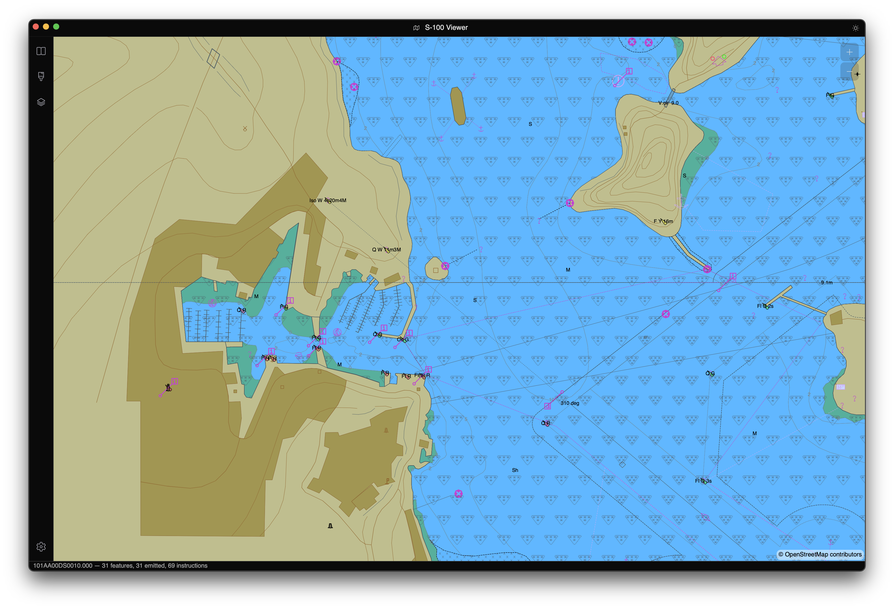
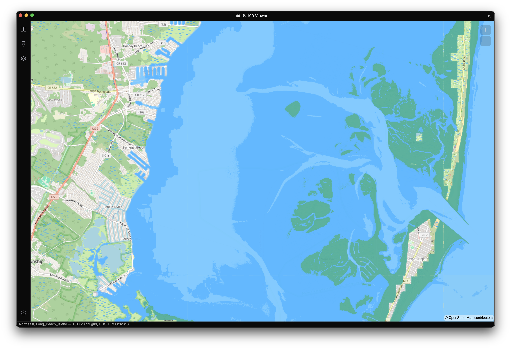
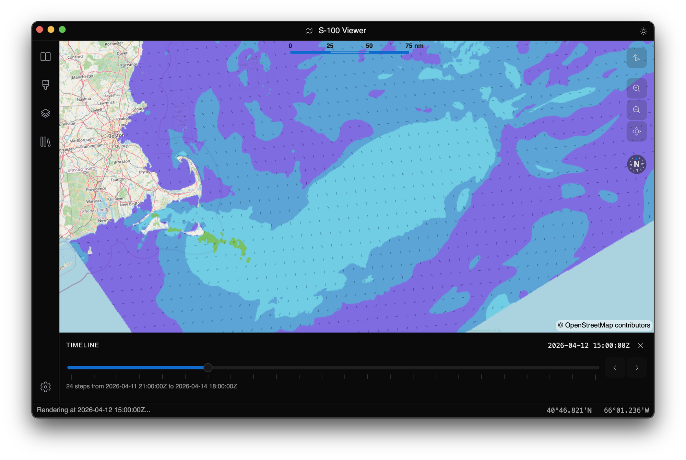
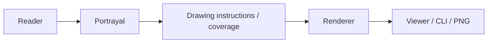

# Documentation

## Why it matters

EncDotNet.S100 combines multiple S-100 products, portrayals, and renderers in one
stack. This documentation is organized to get you to a visible success quickly,
then guide you into deeper API and architecture detail.

## Quick win

  
  
  

  <strong>Start here:</strong> choose your path and get a result in minutes.
  

    <a href="start-here.md">🧭 Audience paths: Viewer / Library / Contributor</a>
    <a href="getting-started.md">⚡ First success in minutes</a>
    <a href="top-apis.md">📚 Curated top APIs by package</a>
  

## Deep dive

## Supported products

| Standard | Subject | Encoding | Portrayal | Validation pack | Library |
|---|---|---|---|---|---|
| **S-101** | Electronic Navigational Charts | ISO 8211 | Lua (Part 9A) | ✅ | [Datasets.S101](../src/EncDotNet.S100.Datasets.S101/README.md) |
| **S-102** | Bathymetric Surfaces | HDF5 | Coverage (Lua) | ✅ | [Datasets.S102](../src/EncDotNet.S100.Datasets.S102/README.md) |
| **S-104** | Water Level Information | HDF5 | Coverage | ✅ | [Datasets.S104](../src/EncDotNet.S100.Datasets.S104/README.md) |
| **S-111** | Surface Currents | HDF5 | Coverage arrows | ✅ | [Datasets.S111](../src/EncDotNet.S100.Datasets.S111/README.md) |
| **S-122** | Marine Protected Areas | GML | XSLT | ✅ | [Datasets.S122](../src/EncDotNet.S100.Datasets.S122/README.md) |
| **S-124** | Navigational Warnings | GML | XSLT | ✅ | [Datasets.S124](../src/EncDotNet.S100.Datasets.S124/README.md) |
| **S-125** | Marine Aids to Navigation | GML | XSLT | ✅ | [Datasets.S125](../src/EncDotNet.S100.Datasets.S125/README.md) |
| **S-127** | Marine Resources & Services | GML | XSLT | ✅ | [Datasets.S127](../src/EncDotNet.S100.Datasets.S127/README.md) |
| **S-128** | Catalogue of Nautical Products | GML | XSLT | ✅ | [Datasets.S128](../src/EncDotNet.S100.Datasets.S128/README.md) |
| **S-129** | Under Keel Clearance Management | GML | XSLT | ✅ | [Datasets.S129](../src/EncDotNet.S100.Datasets.S129/README.md) |
| **S-131** | Marine Harbour Infrastructure | GML | Lua (Part 9A) | ✅ | [Datasets.S131](../src/EncDotNet.S100.Datasets.S131/README.md) |
| **S-201** | Aids to Navigation Information (IALA) | GML | XSLT | ✅ | [Datasets.S201](../src/EncDotNet.S100.Datasets.S201/README.md) |
| **S-411** | Sea Ice Information | GML | XSLT | ✅ | [Datasets.S411](../src/EncDotNet.S100.Datasets.S411/README.md) |
| **S-421** | Route Plans | GML | XSLT | ✅ | [Datasets.S421](../src/EncDotNet.S100.Datasets.S421/README.md) |
| **S-57** *(legacy)* | Electronic Navigational Charts (Ed 3.1) | ISO 8211 | via S-101 pipeline | ✅ (delegated) | [Datasets.S57](../src/EncDotNet.S100.Datasets.S57/README.md) |

## Guides

- [Start here](start-here.md) — audience-based entry page.
- [Getting started](getting-started.md) — first rendered output via Viewer, library, or CLI.
- [Scenario guides](scenarios/render-s102-to-png.md) — task-focused workflows.
- [Top APIs](top-apis.md) — curated API entry points per package.
- [Command-line rendering](cli.md) — full `s100` command and option guide.
- [Embedding the renderer](embedding-the-renderer.md) — scene/rendering integration seam.
- [Typed data models](typed-data-models.md) — strongly-typed projections on feature bags.
- [Observability](observability.md) — logs, traces, and metrics.
- [C# coding style guide](coding-style.md) — normative style for contributors.
- [MCP server](mcp-server.md) — AI-agent tool surface.
- [What's new](whats-new.md) — docs and experience highlights.

## Visual gallery

| S-101 ENC | S-102 Bathymetry |
|---|---|
|  |  |

### Portrayal comparison (before/after workflow)

| Before (base chart context) | After (with temporal/overlay analysis) |
|---|---|
|  |  |

## Design notes

The `design/` folder collects shipped implementation contracts and rationale.

- [Dynamic feature sources](design/dynamic-feature-source.md)
- [Own-ship vessel symbology](design/own-ship-symbology.md)
- [AIS dynamic feature source](design/ais-source.md)
- [S-98 interoperability](design/s98-interoperability.md)

## Troubleshooting

> [!IMPORTANT]
> If the site looks unstyled, verify `docs/styles/main.css` is included as a DocFX resource in `docfx.json`.

## Next step

- [Start here](start-here.md)
- [Getting started](getting-started.md)
- [Top APIs](top-apis.md)
