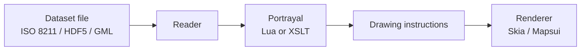

# EncDotNet.S100 documentation

EncDotNet.S100 reads, validates and portrays IHO S-100 nautical data in .NET.
It includes:

- **.NET libraries** that read each supported product, run its portrayal
  catalogue and render the result to an image or an interactive map.
- **SoundCharts**, a desktop viewer for macOS, Windows and Linux.
- **`s100`**, a command-line tool that inspects, validates and renders datasets.
- **An MCP server** that gives AI agents access to loaded datasets.

## Get started

[Getting started](getting-started.md) has a quickstart for each of these:

- [Open a dataset in the desktop app](getting-started.md#desktop-app)
- [Read and render a dataset from .NET](getting-started.md#net-library)
- [Render a dataset from the command line](getting-started.md#command-line-tool)

## Supported products

| Standard | Subject | Encoding | Portrayal | Validation pack | Library |
|---|---|---|---|---|---|
| **S-101** | Electronic Navigational Charts | ISO 8211 | Lua (Part 9A) | ✅ | [Datasets.S101](../src/EncDotNet.S100.Datasets.S101/README.md) |
| **S-102** | Bathymetric Surfaces | HDF5 | Coverage (Lua) | ✅ | [Datasets.S102](../src/EncDotNet.S100.Datasets.S102/README.md) |
| **S-104** | Water Level Information | HDF5 | Coverage | ✅ | [Datasets.S104](../src/EncDotNet.S100.Datasets.S104/README.md) |
| **S-111** | Surface Currents | HDF5 | Coverage arrows | ✅ | [Datasets.S111](../src/EncDotNet.S100.Datasets.S111/README.md) |
| **S-122** | Marine Protected Areas | GML | XSLT | ✅ | [Datasets.S122](../src/EncDotNet.S100.Datasets.S122/README.md) |
| **S-124** | Navigational Warnings | GML | XSLT | ✅ | [Datasets.S124](../src/EncDotNet.S100.Datasets.S124/README.md) |
| **S-125** | Marine Aids to Navigation | GML | XSLT | ✅ | [Datasets.S125](../src/EncDotNet.S100.Datasets.S125/README.md) |
| **S-127** | Marine Resources & Services | GML | XSLT | ✅ | [Datasets.S127](../src/EncDotNet.S100.Datasets.S127/README.md) |
| **S-128** | Catalogue of Nautical Products | GML | XSLT | ✅ | [Datasets.S128](../src/EncDotNet.S100.Datasets.S128/README.md) |
| **S-129** | Under Keel Clearance Management | GML | XSLT | ✅ | [Datasets.S129](../src/EncDotNet.S100.Datasets.S129/README.md) |
| **S-131** | Marine Harbour Infrastructure | GML | Lua (Part 9A) | ✅ | [Datasets.S131](../src/EncDotNet.S100.Datasets.S131/README.md) |
| **S-201** | Aids to Navigation Information (IALA) | GML | XSLT | ✅ | [Datasets.S201](../src/EncDotNet.S100.Datasets.S201/README.md) |
| **S-411** | Sea Ice Information | GML | XSLT | ✅ | [Datasets.S411](../src/EncDotNet.S100.Datasets.S411/README.md) |
| **S-421** | Route Plans | GML | XSLT | ✅ | [Datasets.S421](../src/EncDotNet.S100.Datasets.S421/README.md) |
| **S-401** *(IEHG)* | Inland ENC | ISO 8211 | Lua (Part 9A) | — | [Specifications/content/S401](../src/EncDotNet.S100.Specifications/content/S401/README.md) |
| **S-57** *(legacy)* | Electronic Navigational Charts (Ed 3.1) | ISO 8211 | via S-101 pipeline | ✅ (delegated) | [Datasets.S57](../src/EncDotNet.S100.Datasets.S57/README.md) |

## How the pieces fit

Each dataset goes through the same stages. A product-specific reader decodes
the file, the product's portrayal catalogue turns its features into drawing
instructions, and a renderer draws them. The viewer, the CLI and the library
all use this pipeline.

```mermaid
flowchart LR
  A[Dataset file<br/>ISO 8211 / HDF5 / GML] --> B[Reader]
  B --> C[Portrayal<br/>Lua or XSLT]
  C --> D[Drawing instructions]
  D --> E[Renderer<br/>Skia / Mapsui]
```

## Guides

**Working with data**

- [Loading datasets](loading-datasets.md): files, folders, ZIPs, exchange sets
  and S-101 updates.
- [Reading product data](reading-product-data.md): each product's features,
  typed models, grids and time series.
- [Reading protected exchange sets](protected-exchange-sets.md): S-100 Part 15
  permits, decryption and signatures.
- [Custom catalogues and validation](catalogues-and-validation.md): use your own
  catalogues, and validate datasets.
- [Bringing S-57 into the pipeline](s57-to-s101.md): read S-57 cells through the
  S-101 portrayal.

**Tasks**

- [Render S-102 to PNG](scenarios/render-s102-to-png.md)
- [Inspect S-124 warnings](scenarios/inspect-s124-warnings.md)
- [Compose S-101 and S-102](scenarios/compose-s101-s102.md)

**Rendering and integration**

- [Embedding the renderer](embedding-the-renderer.md): the scene and rendering
  API for interactive maps.
- [Observability](observability.md): logs, traces and metrics.
- [MCP server](mcp-server.md): the tools exposed to AI agents.

## Reference

- [API reference](../api/index.md)
- [Top APIs](top-apis.md): the main entry points in each package.
- [Typed data models](typed-data-models.md): typed views over feature
  attributes.
- [Command-line rendering](cli.md): every `s100` command and option.
- [S-100 feed format](s100-feed-format.md) and
  [local collection manifests](local-collection-manifest.md): the JSON formats
  the viewer's Library reads.
- [What's new](whats-new.md)

## Contributing

- [Contribution guide](../CONTRIBUTING.md)
- [C# coding style](coding-style.md)
- [Documentation style](docs-style.md)
- Design notes, in [`docs/design/`](design/s98-interoperability.md), record the
  rationale behind shipped subsystems. Start with
  [S-98 interoperability](design/s98-interoperability.md) and
  [dynamic feature sources](design/dynamic-feature-source.md).
