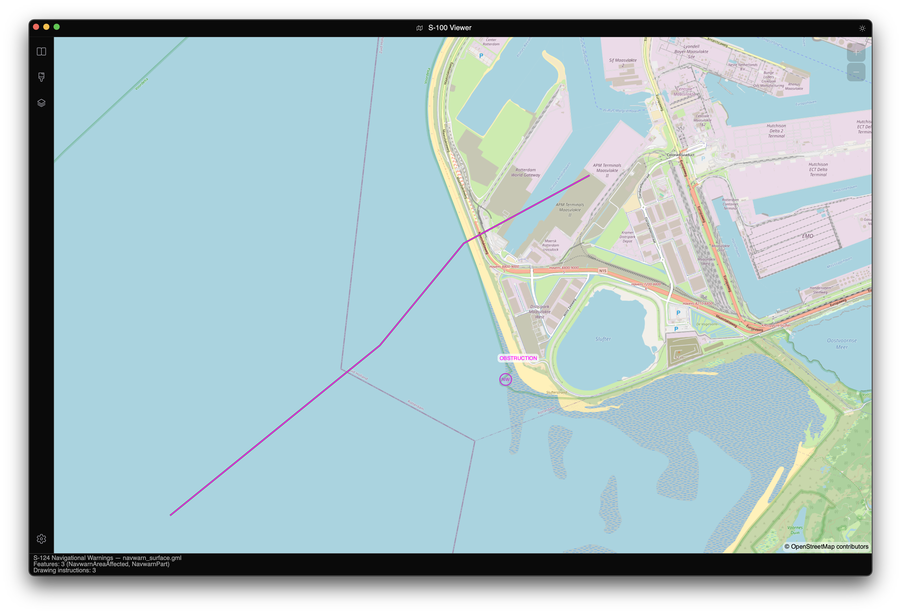

# Scenario: Inspect S-124 navigational warnings

## Why it matters

S-124 datasets are event-heavy and best explored interactively before automation.

## Quick win

Open a `.gml` S-124 dataset in the viewer and inspect features in Pick mode.

## Deep dive

1. Launch viewer and load dataset.
2. Open **Object Information** and click warning features.
3. Switch Day/Dusk/Night palette to validate readability.
4. Use the timeline if the warning set includes temporal transitions.

## Troubleshooting

> [!IMPORTANT]
> If nothing appears, verify the loaded file is S-124 GML and not a different S-12x product with similar geometry.

## Next step

- [MCP server](../mcp-server.md)
- [Top APIs](../top-apis.md)
