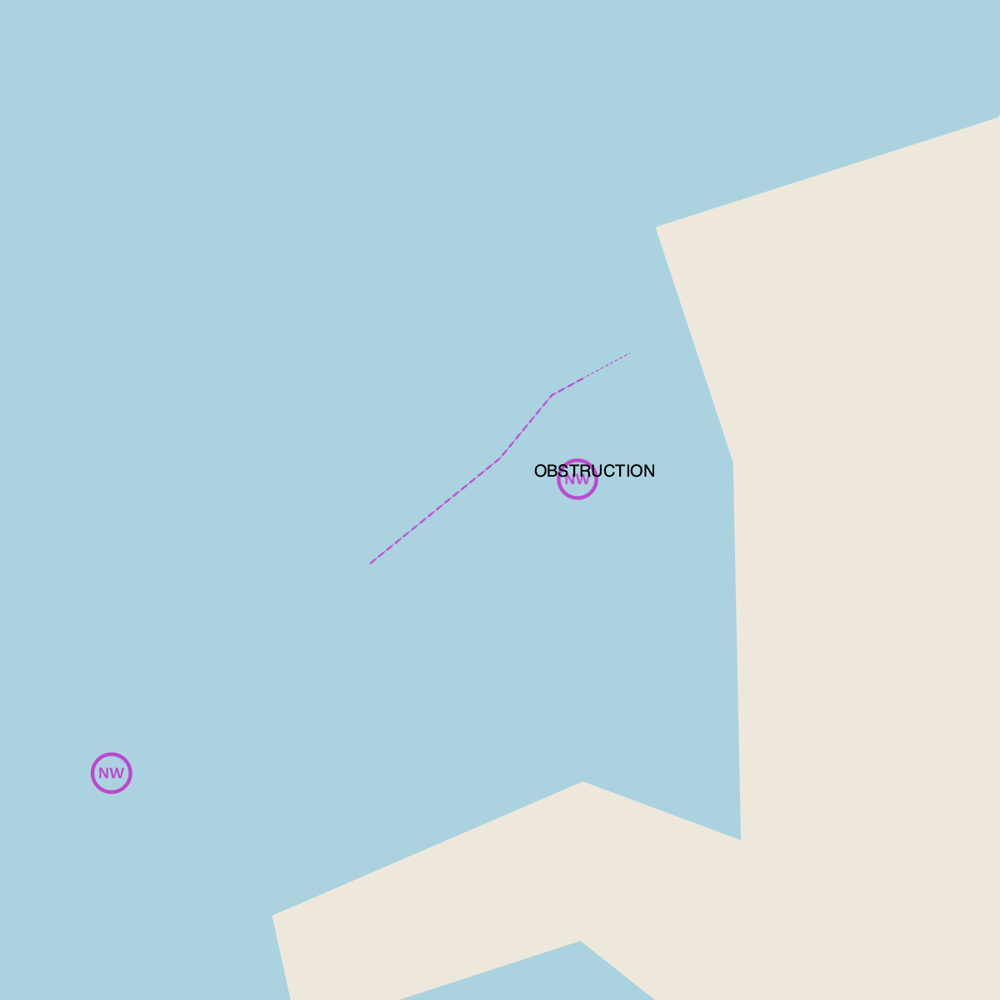

# Inspect S-124 warnings

This guide opens an S-124 navigational warnings dataset in SoundCharts and
shows how to read each warning's attributes on the map. Use it to check what
a warnings file contains before you process it in code.

## Prerequisites

- SoundCharts. See [Getting started](../getting-started.md#desktop-app).
- An S-124 dataset (`.gml`). The repository includes small test files in
  [`tests/datasets/S124/`](https://github.com/philliphoff/EncDotNet.S100/tree/main/tests/datasets/S124).

## Steps

1. Choose **File** > **Open Dataset...** and select the `.gml` file, or drag
   it onto the window. The warning areas, lines and points appear on the map.
2. Turn on pick mode: press <kbd>I</kbd>, select the **Pick mode** button at
   the top right of the map, or choose **View** > **Appearance** >
   **Pick Mode**.
3. Click a warning on the map. The **OBJECT INFORMATION** panel shows the
   feature's ID, attributes, referenced text, references and location. If
   several features are at that point, the panel lists them all. If the panel
   is closed, choose **View** > **Appearance** > **Pick Report**.
4. To check how the warnings read in other lighting conditions, select the
   **Display Settings** button at the top right of the map and choose **Day**,
   **Dusk** or **Night** under **Palette**.

## Result

You can see each warning's geometry on the map and read its attributes in the
panel.



## If nothing appears

Check which product the file was detected as:

```bash
s100 info path/to/warnings.gml
```

The **Specification** row should show `S-124`. Other GML products, such as
S-122 or S-127, can have similar geometry but use their own portrayal.

## Inspect from the command line

`s100 identify` lists the features at a position, like a pick in the viewer:

```bash
s100 identify path/to/warnings.gml --lat 50.1 --lon -1.3
```

`s100 validate` checks the dataset against the S-124 validation rules:

```bash
s100 validate path/to/warnings.gml
```

For the options of each command, see
[Command-line rendering](../cli.md).

## Read warnings in code

To work with warnings as typed objects (preamble, parts, references) instead
of a feature list, use the S-124 typed data model. See
[Typed data models](../typed-data-models.md).
