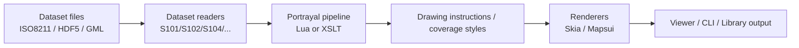

# Start here

> [!TIP]
> New to EncDotNet.S100? Choose one path below and get a visible result in minutes.

## Why it matters

The project has strong technical depth across multiple S-100 products and pipelines.
This page gives you a focused on-ramp so you can get to value faster.

## Quick win

- **Use the Viewer**: [Download a release](https://github.com/philliphoff/EncDotNet.S100/releases), open a dataset, pan and inspect.
- **Integrate the Library**: install `EncDotNet.S100` and render your first PNG in a few lines.
- **Contribute to the Engine**: run the test suite, pick a subsystem, and make a focused improvement.

## Deep dive

### Path 1: Use the Viewer

Best for chart analysts, QA, pilots, and domain experts.

- Start with: [Getting started](getting-started.md#desktop-app)
- Then: [Viewer guide](../src/EncDotNet.S100.Viewer/README.md)
- Next: [MCP server guide](mcp-server.md) for AI-assisted workflows

### Path 2: Integrate the Library

Best for .NET developers embedding S-100 reading/rendering.

- Start with: [Getting started](getting-started.md#library-path)
- Then: [Embedding the renderer](embedding-the-renderer.md)
- Next: [Top APIs](top-apis.md)

### Path 3: Contribute to the Engine

Best for contributors improving datasets, pipelines, and renderers.

- Start with: [Contribution guide](../CONTRIBUTING.md)
- Then: [Documentation index](index.md)
- Next: [What's new](whats-new.md)

### Architecture at a glance

## Troubleshooting

> [!IMPORTANT]
> Common first-run issue: dataset format mismatch. `.000`/ISO8211, `.h5`/HDF5, and `.gml` have different readers and feature sets.

> [!WARNING]
> For EPSG:4326 GML coordinates, follow S-100 Part 10b ordering (`lat lon`) when validating source data and debugging geometry placement.

## Next step

- Continue with [Getting started](getting-started.md)
- Jump into scenarios:
  - [Render S-102 to PNG](scenarios/render-s102-to-png.md)
  - [Inspect S-124 warnings](scenarios/inspect-s124-warnings.md)
  - [Compose S-101 + S-102](scenarios/compose-s101-s102.md)
