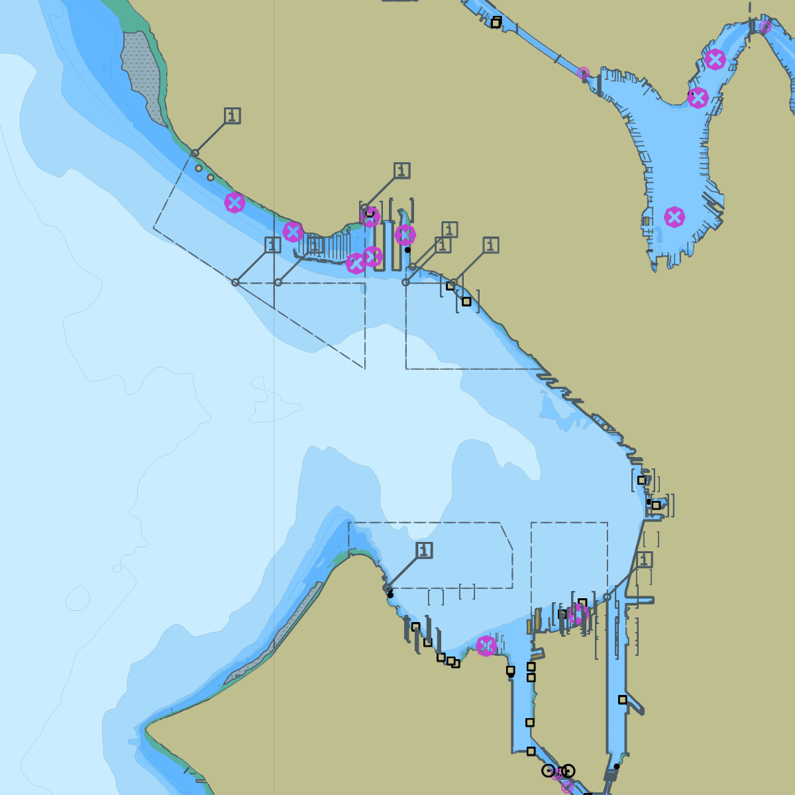
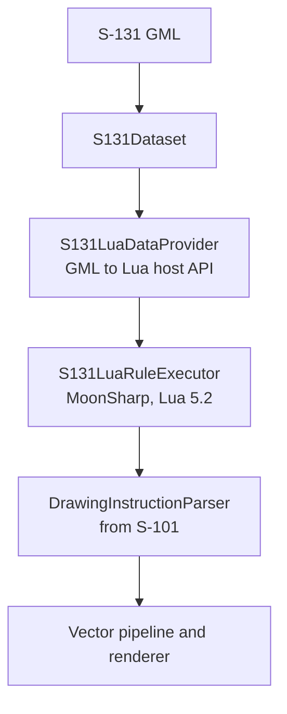

# EncDotNet.S100.Datasets.S131

`EncDotNet.S100.Datasets.S131` reads IHO S-131 Marine Harbour Infrastructure
datasets: GML files (S-100 Part 10b) that describe berths, dolphins, harbour
facilities, terminals and other port infrastructure. It parses a dataset,
projects it into a typed model, validates it, and runs the S-131 Lua portrayal
catalogue (S-100 Part 9A) over it. Reference it when you need typed access to
S-131 data or its validation rules. To open and render any product, including
S-131, use the [`EncDotNet.S100`](../EncDotNet.S100/README.md) package, which
includes this one.



The S-131 data in this screenshot is derived from the NOAA ENC's harbour
features.

## Install

```bash
dotnet add package EncDotNet.S100.Datasets.S131
```

## Read a dataset

Open the dataset from a path or a stream, then read its features:

```csharp
using EncDotNet.S100.Datasets.S131;

var dataset = S131Dataset.Open("path/to/dataset.gml");

foreach (var feature in dataset.Features)
    Console.WriteLine($"{feature.FeatureType}: {feature.Id}");
```

For typed access, project it into the typed model:

```csharp
using EncDotNet.S100.Datasets.S131.DataModel;

var typed = S131HarbourInfrastructureDataset.From(dataset, out var diagnostics);

foreach (var berth in typed.LayoutFeatures.Where(l => l.Kind == S131LayoutKind.Berth))
    Console.WriteLine($"{berth.Id}: {berth.Geometry.Points.FirstOrDefault()}");

foreach (var authority in typed.Authorities)
    Console.WriteLine($"{authority.Id}: contact {authority.ContactDetails?.Id}");
```

## Main types

| Type | Description |
|---|---|
| `S131Dataset` | The parsed dataset: features and information types. `Open` takes a path or a stream. `ReadMetadata` (static, for a path or stream, or on an open dataset) returns the declared product specification and the WGS 84 extent of the feature geometry without running portrayal; the extent is `null` when no feature has geometry, for example a dataset with only an `Authority`. |
| `S131Feature` | A feature with geometry, attributes, complex attributes and xlink references. |
| `S131InformationType` | An information type with attributes and xlink references. |
| `S131LuaDataProvider` | Serves the GML dataset to the Lua rules through the Part 9A host API, and collects the drawing instructions they emit. |
| `S131LuaRuleExecutor` | An `ILuaVectorRuleExecutor` that wraps the core `LuaRuleExecutor` (Part 9A), with the S-131 data provider and the `TwoShades` context parameter. |
| `S131PortrayalCatalogue` | The portrayal catalogue: symbols, palettes and rules. |
| `S131HarbourInfrastructureDataset` | The typed model, in the `DataModel` namespace. See [Typed data model](#typed-data-model). |
| `S131HarbourInfrastructureRules` | The validation rule set. See [Validate](#validate). |

## Typed data model

The `EncDotNet.S100.Datasets.S131.DataModel` namespace projects `S131Dataset`
into typed features and information types. It's separate from portrayal: the
Lua pipeline reads the `S131Dataset` features directly.

### Feature families

Concrete feature types are grouped into four families, taken from the feature
catalogue's supertypes (FC Edition 1.0.0 §B.2 and §B.5). The projection doesn't
read the feature catalogue at run time.

| Family | Typed record | Enum | Feature catalogue supertype and members |
|---|---|---|---|
| `HarbourInfrastructure` | `S131HarbourInfrastructure` | `S131HarbourInfrastructureKind` | `HarbourPhysicalInfrastructure`: Bollard, Dolphin, DryDock, FloatingDock, Gridiron, HarbourFacility, LockBasin, LockBasinPart, MooringBuoy, OnshorePowerFacility, ShipLift, StraddleCarrier, AutomatedGuidedVehicle |
| `Layout` | `S131LayoutFeature` | `S131LayoutKind` | `Layout`: AnchorBerth, AnchorageArea, Berth, BerthPosition, DockArea, DumpingGround, FenderLine, HarbourAreaAdministrative, HarbourAreaSection, HarbourBasin, MooringWarpingFacility, OuterLimit, PilotBoardingPlace, SeaplaneLandingArea, Terminal, TurningBasin, WaterwayArea |
| `Metadata` | `S131MetadataFeature` | `S131MetadataKind` | No shared supertype: DataCoverage, QualityOfNonBathymetricData, SoundingDatum, TextPlacement, VerticalDatumOfData |
| `Unknown` | `S131OtherFeature` | | Any other feature type |

### Information types

| Typed record | Source type | Notes |
|---|---|---|
| `S131Authority` | `Authority` | Has `ContactDetails` and `Applicability` properties that resolve its xlinks to those records. |
| `S131ContactDetails` | `ContactDetails` | |
| `S131Applicability` | `Applicability` | |
| `S131AvailablePortServices` | `AvailablePortServices` | |
| `S131Entrance` | `Entrance` | |
| `S131ServiceHours` | `ServiceHours` | |
| `S131NonStandardWorkingDay` | `NonStandardWorkingDay` | |
| `S131SpatialQuality` | `SpatialQuality` | |
| `S131RxNInformation` | `NauticalInformation`, `Recommendations`, `Regulations`, `Restrictions` | `S131RxNKind` says which; mirrors the feature catalogue's `AbstractRxN` subtypes. |
| `S131OtherInformationType` | Any other type | |

Information types never have geometry.

### Geometry

`S131Geometry` combines the four coordinate collections of `S131Feature` into
one record, with a `GeometryType` of `None`, `Point`, `Curve` or `Surface`.
Positions are `GeoPosition(Latitude, Longitude)` values in decimal degrees
(S-100 Part 10b §6.2).

### References

`xlink:href` references on child elements, such as
`<S131:applicability xlink:href="#info1"/>`, resolve to
`S131ResolvedReference { Role, TargetRef, Target }` entries in the
`ResolvedReferences` property of features and information types. An unresolved
reference has a `null` `Target`, and the projection reports both an
`xlink.unresolved` and an `s131.reference.dangling` diagnostic.

### Diagnostics

The projection reports problems as `ProjectionDiagnostic` entries. `From` throws
only when the dataset has no features and no information types.

| Code | Severity | Meaning |
|---|---|---|
| `xlink.unresolved` | Warning | An `xlink:href` target isn't in the dataset (from `XlinkResolver`). |
| `s131.reference.dangling` | Warning | A reference has no `Target`; reported per role, for easier filtering. |
| `s131.feature.unknown` | Info | A feature type isn't in the typed enums; it becomes `S131OtherFeature`. |
| `s131.information.unknown` | Info | An information type isn't in the typed enums; it becomes `S131OtherInformationType`. |
| `s131.id.duplicate` | Warning | Two objects share a `gml:id`. |
| `attribute.parse.{int,double,bool,datetime}` | Warning | From `AttributeParser`; not currently raised. |

The typed enums follow the S-131 Edition 1.0.0 feature catalogue. The bundled
feature catalogue is Edition 2.0.0. Types it adds are reported as
`s131.feature.unknown` or `s131.information.unknown` and still project as
`S131OtherFeature` or `S131OtherInformationType`.

## Validate

`S131HarbourInfrastructureRules.Default`, in the
`EncDotNet.S100.Datasets.S131.Validation` namespace, is the default rule set for
`S131HarbourInfrastructureDataset`. Each rule ID traces to an S-131 or S-100
clause. The `EncDotNet.S100` package's `dataset.Validate()` runs the same rule
set.

```csharp
using EncDotNet.S100.Datasets.S131;
using EncDotNet.S100.Datasets.S131.DataModel;
using EncDotNet.S100.Datasets.S131.Validation;

var dataset = S131Dataset.Open("path/to/dataset.gml");
var typed = S131HarbourInfrastructureDataset.From(dataset, out _);
var report = S131HarbourInfrastructureRules.Validate(typed);

foreach (var finding in report.Findings)
    Console.WriteLine($"[{finding.Severity}] {finding.RuleId}: {finding.Message}");
```

| Rule ID | Severity | Checks |
|---|---|---|
| `S131-R-1.1` | Error | `HarbourPhysicalInfrastructure` features have non-empty geometry. The container `HarbourFacility` is exempt. |
| `S131-R-1.2` | Error | `Layout` features have non-empty geometry. |
| `S131-R-2.1` | Warning | `availableBerthingLength`, when present, is a non-negative number (metres). |
| `S131-R-3.1` | Error | Every coordinate is within the WGS 84 latitude and longitude ranges (S-100 Part 10b §6.2). |
| `S131-R-3.2` | Error | Surface rings have at least four vertices and are closed (first equal to last). |
| `S131-R-4.1` | Error | Feature and information type `gml:id` values are unique within the dataset. |
| `S131-R-5.1` | Warning | Every `xlink:href`, from features and information types, resolves to an object in the dataset. |
| `S131-R-6.1` | Warning | Feature and information type codes are declared in the S-131 feature catalogue. |

The rules check one dataset at a time. Cross-dataset checks, such as comparing
`Berth` depths with a loaded S-102 surface, aren't included. A rule that needs
other datasets would reach them through `ValidationContext.Services`.

## Portrayal

S-131 is the only GML product whose portrayal catalogue is written in Lua
(S-100 Part 9A); the other GML products' catalogues use XSLT. The pipeline
reads GML like the other GML products and runs Lua rules like S-101:



- The S-131 dataset processor, in `EncDotNet.S100.Datasets.Pipelines`, doesn't
  derive from `GmlDatasetProcessorBase`, which assumes XSLT. It follows the
  S-101 processor's Lua design instead.
- The Lua host API expects numeric IDs, so GML string IDs (`gml:id`) are mapped
  to sequential numbers.
- GML has its geometry inline. The data provider builds spatial records from it
  in the shape S-101's `HostGetSpatialData` expects.
- S-131 puts features and information types in one `<S131:members>` container,
  with no `<member>`/`<imember>` split. The reader tells them apart with the
  list of information type codes from the feature catalogue.

The S-131 portrayal catalogue declares the `TwoShades` context parameter where
S-101 declares `FourShades`. `S131LuaRuleExecutor` binds it as the inverse of
`FourShades`.

## Encoding notes

A dataset puts every feature and information type in one container:

```xml
<S131:Dataset xmlns:S131="http://www.iho.int/S131/1.0"
              xmlns:S100="http://www.iho.int/s100gml/5.0">
  <S131:members>
    <!-- Features and information types in one container -->
    <S131:Berth gml:id="f1">...</S131:Berth>
    <S131:ContactDetails gml:id="info1">...</S131:ContactDetails>
  </S131:members>
</S131:Dataset>
```

- The reader accepts the S-100 GML 5.0 namespace and the older 1.0 profile
  namespace.
- Coordinates are latitude then longitude for `EPSG:4326` (S-100 Part 10b
  §6.2).

## Bundled specification

| Asset | Edition | Notes |
|---|---|---|
| Feature catalogue | 2.0.0 | |
| Portrayal catalogue | 2.0.0 | 41 Lua rule files, 6 SVG symbols |
| GML application schema | 1.0.0 | Namespace `http://www.iho.int/S131/1.0` |

## Dependencies

- `EncDotNet.S100.Core`: GML types and pipeline interfaces.
- `EncDotNet.S100.Datasets.S101`: `DrawingInstructionParser`.
- `EncDotNet.S100.Features`: the feature catalogue reader.
- `EncDotNet.S100.Portrayals`: portrayal catalogue types.

## See also

- [Loading datasets](../../docs/loading-datasets.md): open files, folders, ZIPs
  and exchange sets through the `EncDotNet.S100` package.
- [Reading product data](../../docs/reading-product-data.md): features,
  information types and typed models for each product.
- [Typed data models](../../docs/typed-data-models.md): the typed
  root for each product and the shared diagnostic codes.
- [Custom catalogues and validation](../../docs/catalogues-and-validation.md):
  run the bundled rules and add your own.
