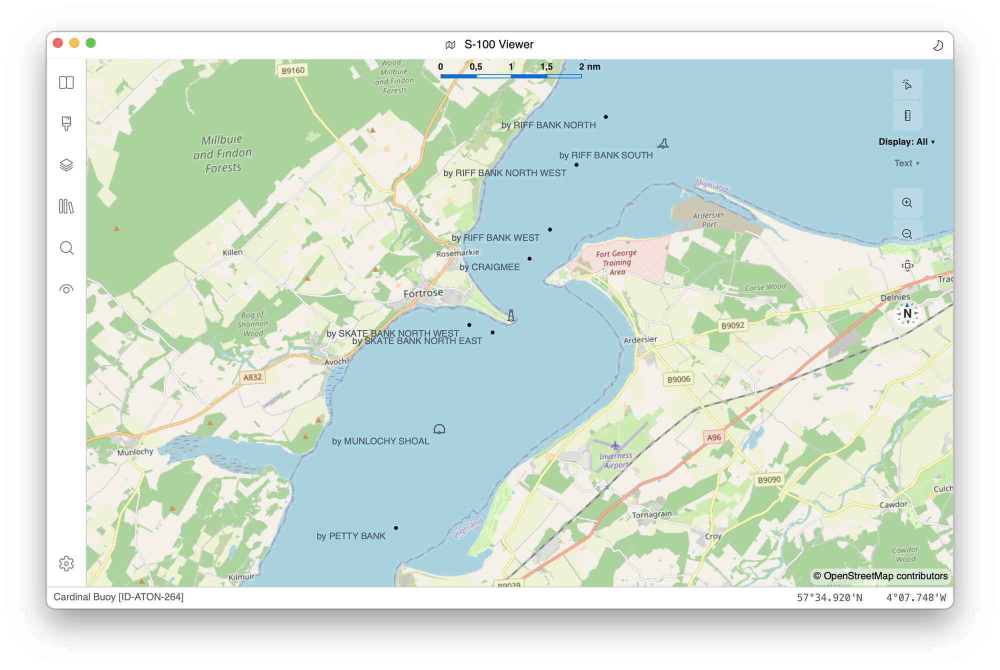

# EncDotNet.S100.Datasets.S201

Library for reading and portraying [IHO/IALA S-201](https://github.com/IALA-IGO/S-201_AtoN-Information)
(Aids to Navigation Information) datasets.



## What S-201 is — and how it differs from S-125

S-201 is the **IALA-led** S-100 product specification for
**authority-to-authority** Aids to Navigation data exchange. It carries
the rich, authoritative AtoN model used by IALA member authorities —
operational and technical attributes, equipment lifecycle, AIS-AtoN
routing, and so on. It is **not** intended for ECDIS display.

[`EncDotNet.S100.Datasets.S125`](../EncDotNet.S100.Datasets.S125/README.md)
covers overlapping physical objects (lights, buoys, beacons, AIS aids)
but is the leaner ECDIS-facing AtoN feature set defined by IHO. The two
specs share a problem domain but are **separate** standards with
separate Feature Catalogues, separate XSDs, separate Portrayal
Catalogues, and separate intended audiences.

| Use case | Spec |
|---|---|
| ECDIS display of AtoN | **S-125** |
| Authority-to-authority AtoN exchange (operational/technical detail) | **S-201** |

This library treats S-125 and S-201 as fully independent products. If
both an S-125 and an S-201 dataset cover the same area the viewer
renders them as independent layers; no merging or deduplication is
attempted.

## Features

- Parse S-201 GML datasets (S-100 Part 10b encoding using the S-100 GML
  5.0 profile; legacy 1.0 namespaces are also tolerated)
- Namespace-driven feature recognition — no hard-coded allow-list of
  the 62 concrete S-201 feature types
- Capture xlink cross-references and split them into:
  - **information references** (target is an information type — e.g.
    `AtoNStatus` → `AtonStatusInformation`,
    `Positioning` → `PositioningInformation`)
  - **feature references** (target is another feature — e.g.
    `theParentFeature` / `theSubordinateFeature` from the
    `Structure/Equipment` aggregation, `peer` from `Aggregations` /
    `Associations`)
- Project to the S-100 Part 9 FeatureXML neutral form
  (`Dataset/Features/*` plus `Dataset/InformationTypes/*`) consumed by
  the S-201 portrayal catalogue
- XSLT-based portrayal via the bundled S-201 Portrayal Catalogue
  (top-level template `main_PaperChart.xsl`)

## Overview

Key types:

- **`S201Dataset`** — root model containing parsed features,
  information types, and dataset identification. Provides
  `ResolveReferencedFeatures` / `ResolveReferencedInformationTypes`
  helpers for walking xlinks by role name.
- **`S201Feature`** — a geographic feature with type code, geometry,
  simple/complex attributes, information references, and feature
  references. Implements `IGmlFeature`.
- **`S201InformationType`** — an information type instance (e.g.
  `AtonStatusInformation`, `PositioningInformation`,
  `AtoNFixingMethod`, `SpatialQuality`). Implements
  `IGmlInformationType`.
- **`S201InformationReference`** — a feature → information-type
  binding captured from an `xlink:href` attribute.
- **`S201FeatureReference`** — a feature → feature binding (e.g.
  equipment ↔ host structure) captured from an `xlink:href`
  attribute.
- **`S201ComplexAttribute`** — a complex attribute group with
  sub-attribute values. Implements `IGmlComplexAttribute`.
- **`S201FeatureXmlSource`** — `IFeatureXmlSource` adapter that
  projects an `S201Dataset` into the synthesised
  `Dataset/Features/*` shape that the S-201 XSLT rules match against.
- **`S201PortrayalCatalogue`** — `IVectorPortrayalCatalogue`
  implementation that loads XSLT rules, symbols, line styles, area
  fills, and color palettes from the bundled catalogue.

## Strongly-typed data model

`S201Dataset` is a faithful but loosely-typed feature bag — attributes
arrive as `ImmutableDictionary<string, string>`, xlinks are unresolved
strings, and equipment ↔ host-structure subordination must be walked
by hand. The **`EncDotNet.S100.Datasets.S201.DataModel`** namespace
adds a strongly-typed projection on top of that bag:

- **`S201AtonInventory`** — root entity. Exposes typed views
  (`Structures`, `Equipment`, `ElectronicAtoNs`), plus the resolved
  `Aggregations`, `Associations`, `StatusInformation`,
  `PositioningInformation`, `FixingMethods`, and `SpatialQualities`
  collections.
- **`S201AtonObject`** (abstract base) — the common AtoN attributes
  shared by every concrete leaf: identifier, lifecycle dates
  (`InstallationDate`, `FixedDateRange`, `PeriodicDateRange`),
  inspection metadata, source provenance, AtoN status timeline, and
  geometry as an enum (`S201GeometryKind`) plus a flat
  `ImmutableArray<GeoPosition>`.
- **`S201StructureObject`** — concrete subclass for beacons, buoys,
  landmarks, lighthouses, light vessels, offshore platforms, etc.
  Adds `AtoNNumber`, `AidAvailabilityCategory`, `Condition`,
  `ContactAddress`, the resolved `MountedEquipment`, and typed
  `PositioningInformation` / `FixingMethods` bindings.
- **`S201Equipment`** — concrete subclass for daymarks, fog signals,
  radar reflectors, racons, power sources, etc. Exposes the
  back-resolved `HostStructure` (the headline subordination
  value-add).
- **`S201Light`** — `Equipment` subclass collapsing the four FC
  light leaves (`LightSectored`, `LightAllAround`,
  `LightAirObstruction`, `LightFogDetector`) into a single class
  discriminated by `LightKind`. Adds `Height`, `Status` codes,
  `VerticalDatum`, `VerticalLength`, `EffectiveIntensity`,
  `PeakIntensity`.
- **`S201ElectronicAtoN`** — collapses the three AIS-AtoN FC leaves
  (`VirtualAISAidToNavigation`, `PhysicalAISAidToNavigation`,
  `SyntheticAISAidToNavigation`) into one class discriminated by
  `AisAtonKind`. Carries `MmsiCode`, AIS `Status`, and (for
  Physical / Synthetic variants) the resolved `HostStructure`.
- **`S201GenericAtonObject`** — fallback for AtoN features the
  typed model has no dedicated subclass for (e.g. `NavigationLine`,
  `DataCoverage`, `DangerousFeature`). Carries the common
  `S201AtonObject` attributes plus geometry and round-trips
  everything else through `ExtraAttributes`.

The projection is **read-only** and **never throws** except when the
source dataset has neither features nor information types. Every
other failure — unresolved xlinks, attribute parse errors,
unexpected target types — surfaces as a
`ProjectionDiagnostic` entry on the `out` parameter.

### How this differs from the S-125 typed model

Both S-201 and S-125 carry AtoN data, but they are independent
specifications with different audiences (operational vs ECDIS
display). The S-201 typed model exposes:

1. **Equipment ↔ host-structure subordination** as a typed
   bidirectional reference (`Equipment.HostStructure`,
   `Structure.MountedEquipment`).
2. **AtoN lifecycle** (`InstallationDate`, `FixedDateRange`,
   `PeriodicDateRange`) on every AtoN.
3. **AtoN status timeline** via the `AtoNStatus` info-binding,
   including the `ChangeTypes` codelist.
4. **Positioning / fixing-method bindings** on structures.
5. **Remote monitoring system** metadata on equipment.

The two typed models share **only** the abstractions in
`EncDotNet.S100.Core.DataModel` (`GeoPosition`,
`ProjectionDiagnostic`, `ProjectionContext`, `XlinkResolver`,
`AttributeParser`, `ExtraAttributes`). They do **not** share any
spec-level types. If your application consumes both, project each
dataset to its own typed model and reconcile at the call site.

### Quick start (typed model)

```csharp
using EncDotNet.S100.Datasets.S201;
using EncDotNet.S100.Datasets.S201.DataModel;

var dataset = S201Dataset.Open("aton.gml");
var inventory = S201AtonInventory.From(dataset, out var diagnostics);

// Walk the inventory by host structure.
foreach (var structure in inventory.Structures)
{
    Console.WriteLine($"{structure.FeatureClass} {structure.AtoNNumber}");
    foreach (var equipment in structure.MountedEquipment)
    {
        var kind = equipment is S201Light light
            ? $"Light/{light.Kind}"
            : equipment.FeatureClass;
        Console.WriteLine($"  → {kind} {equipment.Id}");
    }
}

// Filter AIS AtoNs by kind.
foreach (var ais in inventory.ElectronicAtoNs.Where(a => a.Kind == AisAtonKind.Virtual))
    Console.WriteLine($"Virtual AIS {ais.Id} MMSI={ais.MmsiCode}");

// Diagnostics are non-fatal.
foreach (var d in diagnostics)
    Console.Error.WriteLine($"{d.Severity} {d.Code}: {d.Message}");
```

## Notes

- S-201 Edition 2.0.0 application schema namespace is
  `http://www.iho.int/S-201/gml/cs0/1.0`. Note the legacy-style hyphen
  and `/gml/cs0/1.0` suffix; this is intentional and distinct from
  the cleaner `S125/1.0` form.
- Geometry uses the S-100 GML 5.0 profile namespace
  `http://www.iho.int/s100gml/5.0`. The reader is also tolerant of
  the older S-100 GML 1.0 profile namespaces still seen in some
  pre-publication encoders.
- Coordinate ordering in `<gml:pos>` / `<gml:posList>` follows the
  S-100 Part 10b §6.2 convention of **lat lon** for `EPSG:4326`.
- The bundled portrayal catalogue is taken from the IALA-IGO upstream
  repository at commit `7ddfe8145812141fb8ca413107254f42febd893e`; see
  [`EncDotNet.S100.Specifications/content/S201/README.md`](../EncDotNet.S100.Specifications/content/S201/README.md)
  for full provenance and the upstream → bundled rename mapping. The
  catalogue ships a single Day-only color profile.
- Renderers must tolerate geometry-less features — abstract
  supertypes such as `AidsToNavigation`, `StructureObject`, and
  `Equipment`, plus aggregation containers like `AtonAggregation` and
  `AtonAssociation`, may carry no geometry.
- Time validity (`fixedDateRange`, `periodicDateRange`) is interpreted
  as UTC; do not coerce to local time at the source.

## License

The bundled S-201 specification assets in `EncDotNet.S100.Specifications`
are © IALA and used in accordance with their open-publication terms;
see <https://github.com/IALA-IGO/S-201_AtoN-Information>.
