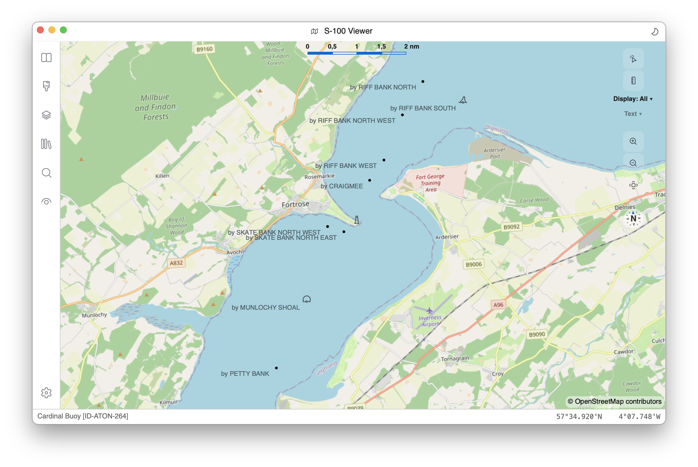

# EncDotNet.S100.Datasets.S201

`EncDotNet.S100.Datasets.S201` reads
[IALA S-201](https://github.com/IALA-IGO/S-201_AtoN-Information) Aids to
Navigation Information datasets: GML files (S-100 Part 10b, S-100 GML 5.0
profile) that authorities use to exchange detailed data about their aids to
navigation. It parses a dataset, resolves the links between aids, equipment and
information records, projects it into a typed inventory, validates it, and loads
the S-201 portrayal catalogue. Reference it when you need typed access to S-201
data or its validation rules. To open and render any product, including S-201,
use the [`EncDotNet.S100`](../EncDotNet.S100/README.md) package, which includes
this one.



## Install

```bash
dotnet add package EncDotNet.S100.Datasets.S201
```

## Read a dataset

Open the dataset, then project it into the typed inventory:

```csharp
using EncDotNet.S100.Datasets.S201;
using EncDotNet.S100.Datasets.S201.DataModel;

var dataset = S201Dataset.Open("path/to/aton.gml");
var inventory = S201AtonInventory.From(dataset, out var diagnostics);

// List each structure and the equipment mounted on it.
foreach (var structure in inventory.Structures)
{
    Console.WriteLine($"{structure.FeatureClass} {structure.AtoNNumber}");
    foreach (var equipment in structure.MountedEquipment)
    {
        var kind = equipment is S201Light light
            ? $"Light/{light.Kind}"
            : equipment.FeatureClass;
        Console.WriteLine($"  {kind} {equipment.Id}");
    }
}

// Filter AIS aids by kind.
foreach (var ais in inventory.ElectronicAtoNs.Where(a => a.Kind == AisAtonKind.Virtual))
    Console.WriteLine($"Virtual AIS {ais.Id} MMSI={ais.MmsiCode}");

foreach (var diagnostic in diagnostics)
    Console.Error.WriteLine($"{diagnostic.Severity} {diagnostic.Code}: {diagnostic.Message}");
```

## Main types

- **`S201Dataset`**: the parsed dataset, with its features, information types
  and dataset identification. `Open` takes a path or a stream.
  `ResolveReferencedFeatures` and `ResolveReferencedInformationTypes` follow a
  feature's xlinks by role name. `ReadMetadata` (static, for a path or stream,
  or on an open dataset) returns the declared product specification and the WGS
  84 extent of the feature geometry without running portrayal. The extent is
  `null` when no feature has geometry.
- **`S201Feature`**: a feature with its type code, geometry, simple and complex
  attributes, information references and feature references. It implements
  `IS100Feature`.
- **`S201InformationType`**: an information type, such as
  `AtonStatusInformation`, `PositioningInformation`, `AtoNFixingMethod` or
  `SpatialQuality`. It implements `IS100InformationType`.
- **`S201InformationReference`**: a link from a feature to an information
  type, read from an `xlink:href` attribute.
- **`S201FeatureReference`**: a link from a feature to another feature, such as
  equipment to its host structure, read from an `xlink:href` attribute.
- **`S201ComplexAttribute`**: a complex attribute's sub-attributes. It
  implements `IS100ComplexAttribute`.
- **`S201AtonInventory`**: the typed model. See
  [Typed data model](#typed-data-model).
- **`S201AtonRules`**: the validation rule set. See [Validate](#validate).
- **`S201FeatureXmlSource`**: an `IFeatureXmlSource` that converts an
  `S201Dataset` to the S-100 Part 9 FeatureXML form (`Dataset/Features/*` and
  `Dataset/InformationTypes/*`) that the S-201 XSLT rules match against.
- **`S201PortrayalCatalogue`**: an `IVectorPortrayalCatalogue` that loads the
  bundled catalogue's XSLT rules, symbols, line styles, area fills and colour
  palettes.

The reader recognizes features by namespace, so it doesn't need a list of the
62 concrete S-201 feature types. It splits xlinks into two kinds:

- **Information references**, whose target is an information type. For
  example, `AtoNStatus` to `AtonStatusInformation`, and `Positioning` to
  `PositioningInformation`.
- **Feature references**, whose target is another feature. For example,
  `theParentFeature` and `theSubordinateFeature` from the `Structure/Equipment`
  aggregation, and `peer` from `Aggregations` and `Associations`.

## S-201 and S-125

S-201 is the IALA product specification for exchanging aid-to-navigation data
between authorities. It carries the full model that IALA member authorities
use: operational and technical attributes, equipment lifecycle, AIS aid
routing and more. It isn't meant for ECDIS display.

[`EncDotNet.S100.Datasets.S125`](../EncDotNet.S100.Datasets.S125/README.md)
covers many of the same physical objects (lights, buoys, beacons, AIS aids), but
S-125 is the IHO's smaller aid-to-navigation feature set for ECDIS. The two are
separate standards, with separate feature catalogues, XSDs and portrayal
catalogues, and different audiences.

| Use | Specification |
|---|---|
| Show aids to navigation in ECDIS | S-125 |
| Exchange operational and technical aid data between authorities | S-201 |

This library treats S-125 and S-201 as independent products. When an S-125 and
an S-201 dataset cover the same area, the viewer draws them as separate layers;
it doesn't merge or deduplicate them.

## Typed data model

`S201Dataset` is a feature bag: attributes are
`ImmutableDictionary<string, string>` values, xlinks are unresolved strings, and
you'd have to follow equipment-to-structure links yourself. The
`EncDotNet.S100.Datasets.S201.DataModel` namespace projects it into typed
objects:

- **`S201AtonInventory`** is the root. It has typed lists (`Structures`,
  `Equipment`, `ElectronicAtoNs`) and the resolved `Aggregations`,
  `Associations`, `StatusInformation`, `PositioningInformation`,
  `FixingMethods` and `SpatialQualities`.
- **`S201AtonObject`** is the abstract base for every aid. It has the
  attributes all aids share: identifier, lifecycle dates (`InstallationDate`,
  `FixedDateRange`, `PeriodicDateRange`), inspection data, source, status
  history, and geometry as an `S201GeometryKind` plus an
  `ImmutableArray<GeoPosition>`.
- **`S201StructureObject`** is for beacons, buoys, landmarks, lighthouses,
  light vessels, offshore platforms and other structures. It adds `AtoNNumber`,
  `AidAvailabilityCategory`, `Condition`, `ContactAddress`, the resolved
  `MountedEquipment`, and typed `PositioningInformation` and `FixingMethods`.
- **`S201Equipment`** is for daymarks, fog signals, radar reflectors, racons,
  power sources and other equipment. `HostStructure` is the structure it's
  mounted on.
- **`S201Light`** is an `S201Equipment` that covers the four light types in the
  feature catalogue (`LightSectored`, `LightAllAround`, `LightAirObstruction`,
  `LightFogDetector`); `Kind` (a `LightKind`) says which. It adds `Height`,
  `Status` codes, `VerticalDatum`, `VerticalLength`, `EffectiveIntensity` and
  `PeakIntensity`.
- **`S201ElectronicAtoN`** covers the three AIS aid types
  (`VirtualAISAidToNavigation`, `PhysicalAISAidToNavigation`,
  `SyntheticAISAidToNavigation`); `Kind` (an `AisAtonKind`) says which. It has
  `MmsiCode`, the AIS `Status` and, for physical and synthetic aids, the
  resolved `HostStructure`.
- **`S201GenericAtonObject`** is for aid features with no dedicated class, such
  as `NavigationLine`, `DataCoverage` and `DangerousFeature`. It has the shared
  `S201AtonObject` attributes and geometry, and keeps everything else in
  `ExtraAttributes`.

The projection is read-only. `From` throws only when the dataset has no
features and no information types. Everything else, such as an unresolved xlink,
an attribute that doesn't parse or a target of an unexpected type, becomes a
`ProjectionDiagnostic` in the `out` parameter.

### Compared with the S-125 typed model

The S-201 typed model adds what the authority exchange needs:

1. Equipment and host structure linked both ways (`Equipment.HostStructure`,
   `Structure.MountedEquipment`).
2. Lifecycle dates (`InstallationDate`, `FixedDateRange`, `PeriodicDateRange`)
   on every aid.
3. Status history through the `AtoNStatus` information binding, including the
   `ChangeTypes` code list.
4. Positioning and fixing-method bindings on structures.
5. Remote monitoring system data on equipment.

The two typed models share only the types in the `EncDotNet.S100.DataModel`
namespace (`GeoPosition`, `ProjectionDiagnostic`, `ProjectionContext`,
`XlinkResolver`, `AttributeParser`, `ExtraAttributes`), not any
product-specific types. If you use both, project each dataset to its own model
and reconcile them in your code.

## Validate

`S201AtonRules`, in the `EncDotNet.S100.Datasets.S201.Validation` namespace, is
the default rule set for `S201AtonInventory`. Rule IDs have the form
`S201-R-{clause}` and trace to S-201 Edition 2.0.0, or to S-100 Part 10b §6.2
and §6.4 for coordinates and identifiers. The rules focus on the integrity of
the inventory: xlink resolution, equipment-to-structure links, aggregation
membership and AIS MMSI format. The `EncDotNet.S100` package's
`dataset.Validate()` runs the same rule set.

```csharp
using EncDotNet.S100.Datasets.S201;
using EncDotNet.S100.Datasets.S201.DataModel;
using EncDotNet.S100.Datasets.S201.Validation;

var dataset = S201Dataset.Open("path/to/aton.gml");
var inventory = S201AtonInventory.From(dataset, out _);
var report = S201AtonRules.Validate(inventory);

foreach (var finding in report.Findings)
    Console.WriteLine($"[{finding.Severity}] {finding.RuleId}: {finding.Message}");
```

| Rule ID | Severity | Checks |
|---|---|---|
| `S201-R-1.1` | Error | Aid coordinates are within the WGS 84 latitude and longitude ranges. |
| `S201-R-1.2` | Error | `gml:id` values are unique across aids, aggregations and information types. |
| `S201-R-1.3` | Warning | Physical aids (structures, equipment and non-virtual AIS aids) have at least one coordinate. |
| `S201-R-2.1` | Error | Physical and synthetic AIS aids have a nine-digit `mMSICode`. |
| `S201-R-2.2` | Warning | Virtual AIS aids that have an `mMSICode` use the nine-digit format. |
| `S201-R-3.1` | Error | `AtonStatusInformation` `ChangeTypes` is one of the listed values 1 to 4. |
| `S201-R-4.1` | Warning | Aid date ranges have the start on or before the end when both are present. |
| `S201-R-5.1` | Warning | Equipment resolves to a host structure through `StructureEquipment`. |
| `S201-R-6.1` | Warning | Each `AtonAggregation` or `AtonAssociation` references at least two aids. |
| `S201-R-6.2` | Error | Every `AtonAggregation` and `AtonAssociation` peer xlink resolves. |

The rules check one dataset at a time. Cross-dataset checks, such as comparing
an aid's position with an S-101 chart, aren't included. Problems found while
projecting are reported in the diagnostics from `From`.

## Portrayal

The bundled S-201 portrayal catalogue's top-level template is
`main_PaperChart.xsl`. It's taken from the IALA-IGO upstream repository at
commit `7ddfe8145812141fb8ca413107254f42febd893e`, and has a single Day colour
profile. See
[`EncDotNet.S100.Specifications/content/S201/README.md`](../EncDotNet.S100.Specifications/content/S201/README.md)
for its provenance and how upstream files were renamed.

## Encoding notes

- S-201 datasets come in two shapes, and the reader accepts both:
  - The shape the bundled application schema declares: a `<Dataset>` root in
    the namespace `http://www.iho.int/S-201/gml/cs0/1.0`, with `<member>`
    wrappers for features and `<imember>` wrappers for information types, as
    in S-125 and S-127. The hyphen and `/gml/cs0/1.0` suffix are part of the
    namespace.
  - The shape seen in IALA-IGO sample and operational datasets: a `<DataSet>`
    root in the namespace `http://www.iho.int/S-201/gml/cs0/2.0` (or the older
    `http://www.iho.int/201/gml/1.0`), with one `<members>` container for
    features and information types. Features in this shape are usually in the
    default namespace.
- Geometry uses the S-100 GML 5.0 profile namespace,
  `http://www.iho.int/s100gml/5.0`. The reader also accepts the older S-100 GML
  1.0 namespaces that some encoders still write.
- Coordinates in `<gml:pos>` and `<gml:posList>` are latitude then longitude
  for `EPSG:4326` (S-100 Part 10b §6.2).
- Some features have no geometry: abstract supertypes such as
  `AidsToNavigation`, `StructureObject` and `Equipment`, and aggregation
  containers such as `AtonAggregation` and `AtonAssociation`. Code that reads
  features must allow for that.
- Time validity (`fixedDateRange`, `periodicDateRange`) is UTC. Don't convert
  it to local time when you read it.

## License

The bundled S-201 specification assets in `EncDotNet.S100.Specifications` are
© IALA and are used under their open-publication terms; see
<https://github.com/IALA-IGO/S-201_AtoN-Information>.

## See also

- [Loading datasets](../../docs/loading-datasets.md): open files, folders, ZIPs
  and exchange sets through the `EncDotNet.S100` package.
- [Reading product data](../../docs/reading-product-data.md): features,
  information types and typed models for each product.
- [Typed data models](../../docs/typed-data-models.md): the typed
  root for each product and the shared diagnostic codes.
- [Custom catalogues and validation](../../docs/catalogues-and-validation.md):
  run the bundled rules and add your own.
